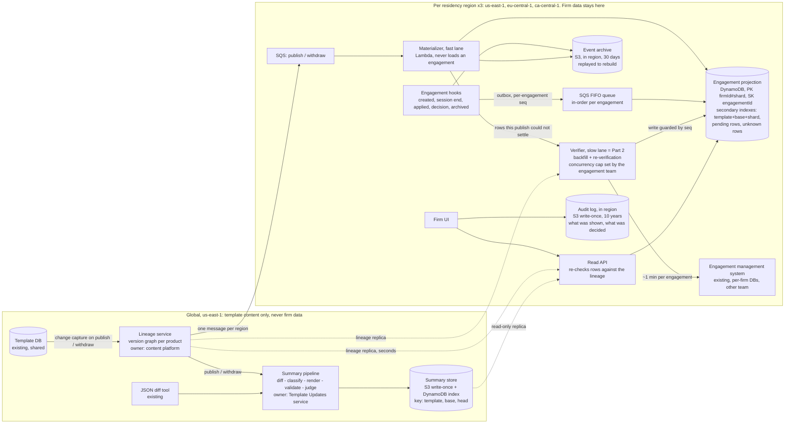

```mermaid
stateDiagram-v2
  [*] --> UNKNOWN : row seeded from the engagement list, base not yet confirmed
  UNKNOWN --> NONE : base confirmed, no eligible head
  UNKNOWN --> PENDING : base confirmed, an eligible newer head exists
  NONE --> PENDING : publish(T), T descends from the base on this branch, not declined
  NONE --> PENDING : publish(T), base withdrawn, T descends from its nearest published ancestor
  PENDING --> PENDING : publish(T2) newer than T, target and summary move to T2
  PENDING --> NONE : decline(T) logged; T and its ancestors back to the base are now covered
  PENDING --> NONE : withdraw(T), no other eligible target
  PENDING --> PENDING : withdraw(T), an older eligible target remains
  PENDING --> NONE : apply(T) confirmed by UpdateApplied or SessionEnded, base becomes T
  PENDING --> PENDING : apply(T) confirmed, a newer head already exists
```

# Pending Template Updates: Design

*Rates from `docs/design/cost-inputs.md` (AWS `us-east-1`, Anthropic pricing, 2026-09-19).*

## 1. Architecture and data ownership

This section decides where the data lives and who owns it.

A new **Template Updates service** adds one table with one row per engagement file. The row records which template version that file sits on, and whether an update is waiting. The engagement system stays the source of truth.

Two facts force that shape. First, finding out which version a file is really on means loading it, at a minute of another team's capacity, so the publish path may never load one (§3, row 2). Second, template content is the same for every firm, so one summary of the version 5 to version 7 change serves every file on version 5. Only about twelve versions per product still have a file on them (my estimate, stress-tested at 52 in row 15), so a publish needs twelve summaries, not 20,000: $166 a month, not $277,000.

So the table is a per-region **projection** of `(engagement, template, effective base, decision log)`, kept current by events. A publish updates a small global **lineage graph**, which fans out a recompute over projection rows in seconds and cents. The one-minute load happens only inside a rate-limited **verifier**, the Part 2 worker.

**Lineage graph** (new, global, owned by the content platform). One node per `(templateId, version)`, holding its parents, market, status and content hash. It is fed by change data capture, reading the template database's own write log, not by code that commits and then emits, which loses a publish whenever the emit fails. It answers one question: what is the newest published, non-withdrawn descendant of a given base?

**Engagement projection** (new, one DynamoDB table per region, owned by Template Updates). The key is `PK = firmId#shard`, `SK = engagementId`, with `shard = hash(engagementId) mod 16`.

| Attribute | Meaning |
|---|---|
| `templateId`, `market` | Which lineage this file is eligible for |
| `baseVersion`, `baseSource`, `lastVerifiedAt` | Effective base: creation version, replaced on a confirmed apply |
| `pendingTarget`, `state` | Newest eligible head at last recompute; `UNKNOWN`, `NONE`, `PENDING` (§2) |
| `decisions[]` | Append-only `{target, diffHash, summaryId, decidedAt, decidedBy}`, as sibling items |
| `lastSeq`, `lineageVersionApplied`, `unverified` | Ordering guards and a drift flag |

Three secondary indexes sit on it: `templateId#baseVersion#shard` drives the fan-out, a `PENDING`-only index serves the file list, an `UNKNOWN`-only index is the backfill queue. The shard keeps the 40,000-file firm off one partition key. Even with all 40,000 on one product, a publish writes 2,500 rows per key, or 42 a second across the 60-second budget, against DynamoDB's limit of 1,000. The row is firm data and never leaves its region.

**Engagement system** (existing, the other team). I ask for six additive changes. Five are outbox hooks — events written in the same transaction as the data, so they cannot be lost — each carrying a per-engagement counter `seq`: `EngagementCreated`, `SessionEnded(effectiveVersion)`, `UpdateApplied(newVersion)` for an apply outside a session, `DecisionRecorded` and `EngagementArchived`. The sixth adds `{target, summaryId, diffHash}` to their decision record, pinning at source what a decision was made against (§4).

**Publish flow.** The lineage sends one message per region. The **materializer** reads the fan-out index once per live base and expands the matches into SQS batches of ten rows: about 20,000 conditional writes, no engagement loaded. Each write requires that `lineageVersionApplied` predates this publish and that `lastSeq` has not moved since the read, so a hook that got there first is never overwritten. Every event is also archived to in-region S3 for 30 days, which a rebuild replays. Summaries are the one thing held globally, because they contain no firm data (§4).

The read API serves the pending list from that index and re-checks each row against the in-memory lineage as it reads, so a withdrawal disappears at the next read. Re-checking can only clear a pending flag, never set one, so a lost fan-out write stays quiet until the nightly recompute. The 60-second freshness target therefore covers the fan-out path only.

## 2. Correctness and production evolution

This section decides what a row may say about a file, and how it survives late or missing events. The projection may be stale, but it may never say "no updates" when it does not know, so `UNKNOWN` reads as "checking".

Eligibility is descent on a market branch, never a version-number comparison, so a Canadian file is never offered a UK head. I assume a file belongs to one branch, inherited from its creation version. An accept is logged at once, but the row leaves `PENDING` only once the new base is confirmed, reading as "applying" meanwhile.

**Accumulation and what "declined" pins.** If v4, v5 and v6 all publish before the user acts, the user sees one summary from base to v6 and makes one decision. It is recorded against the pair shown, even if a newer head lands meanwhile.

A decline pins nothing about the file, which stays on its base. It records the pair the user was shown, and it covers every version between the base and the target, because the summary they read contained those changes. Otherwise declining v6 would expose v5 a second later, and the user would be asked three times about changes they read once.

The diff always starts from the file's actual base, so a declined v5 is never a diff origin. When v7 arrives carrying v5's changes, the row returns to `PENDING(v7)` with a line built from v7's ancestors and the decision log, not by a model: "includes changes from v5, declined on 3 March". A firm that declines weekly is asked weekly, because a false "nothing pending" is the expensive error here.

**Withdrawal.** A withdrawal retargets affected rows inside the same 60-second budget. A file whose base is withdrawn is evaluated from the nearest published ancestor of that base. Worked case: a firm sits on v6, v6 is withdrawn, the fix v7 branches off v5, and the firm is still offered v7, diffed from v6. Otherwise it hears "no pending updates" forever.

**Unreliable and out-of-order delivery.** Both producers are outboxes, so nothing is lost at the source. Engagement hooks go through an SQS FIFO queue, one ordered group per file. Each event carries the counter `seq`, and a write lands only if the row's counter is exactly one less. Exactly one less, not merely lower: under "merely lower" the last writer wins, and a decline of v5 arriving behind a later session-end event would vanish in silence. A message whose predecessor is missing is retried with a delay, and after ten minutes the row is flagged `unverified`.

**Loss and drift.** A base changes only while the file is loaded, and every session end re-states the effective version, so a lost apply self-heals at the next open. Reconciliation compares each row's `lastVerifiedAt` against the engagement list's `lastOpenedAt` and verifies only the mismatches. A nightly recompute catches a missed fan-out for cents.

**Migration and backfill, with no window.** Deploy the lineage, the empty tables and the hooks behind flags, one region and one product at a time. The `seq` counter starts at 1 on deploy. Each seeded `UNKNOWN` row is written with `lastSeq = 0`, only where no row exists, so a seed never overwrites a live row. Backfill then piggybacks on normal use, since every session end confirms a row for free. The verifier sweeps the rest, round-robin with a 5% per-firm cap, without which the 40,000-file firm alone takes 667 slot-hours.

The cap is set by the engagement team and can be lowered at any time without a deploy. They grant 50 loads, split by file count: about 33 in `us-east-1` and 17 across the two others, making the backfill 11 days. The verifier also halves its in-flight count whenever that system's p99 open latency — its slowest 1% — leaves the normal band.

Writing a verifier result back is not always safe, because the user may apply an update during its one-minute load. So the enqueue carries `lastSeqAtEnqueue`, the write requires `lastSeq` to still equal it, and a stale result is discarded. That guard is part of the Part 2 contract.

## 3. Scale, cost and operational characteristics

This section decides the budget and shows the arithmetic. The feature costs about $280 a month, or $1,100 at worst, against a ceiling I propose at $2,500. Inference is 87% of that, and the bill turns on one summary per version pair rather than one per file.

| # | Quantity | Arithmetic | Result |
|---|---|---|---|
| 1 | Publishes/month; files/product | 40/week × 52 ÷ 12; 800,000 ÷ 40 | 173; 20,000 |
| 2 | Naive publish path (rejected) | 20,000 × 1 min | 333 downstream-hours; 3.3 h at 100-wide |
| 3 | Backfill capacity (one-off) | 800,000 × 1 min = 13,333 slot-hours ÷ 50 slots | 11 days |
| 4 | Backfill cost (one-off) | writes: 1.6 M (800k seeds + 800k results) × 3 write units × $0.625/M = $3. Summaries: 40 products × 12 live bases = 480 pairs × $0.117 = $56; at 52 bases, 2,080 pairs = $243 | $59-$246 |
| 5 | Fan-out writes | 173 publishes × 20,000 files = 3.46 M rows. A ~1 KB row (decision log kept in sibling items) costs 1 write unit on the table + 1 on the pending index = 2. 6.9 M × $0.625/M | $4.3 |
| 6 | Hook writes | each file opened ~3.75×/month = 3 M session events; these move the base, so they rewrite the fan-out index entry too = 3 units. 9 M × $0.625/M | $5.6 |
| 7 | SQS | hooks: 3 M events × 3 (send, receive, delete) = 9 M FIFO × $0.50/M. Fan-out: 3.46 M rows, ten per message = 346k × 3 = 1.0 M × $0.40/M | $4.9 |
| 8 | Lambda | 3 M hooks + 0.35 M fan-out + 5 M read-API = 8.4 M × $0.20/M, each 0.25 s at 0.5 GB = 1.05 M GB-s × $0.0000133 | $15.7 |
| 9 | Reads and storage | 5 M badge queries × 4 read units (a 32 KB page, eventually consistent at half a unit per 4 KB) + 3 M nightly recompute = 23 M × $0.125/M; 0.8 GB of rows × $0.25; 1.3 GB summaries + 6.5 GB event archive × $0.023 | $3.3 |
| 10 | EU / CA premium | a third of files are in the EU and Canada, so +15% on ~$11 of rows 5-9 | $1.7 |
| 11 | Summaries per month | 173 publishes × ~12 live bases per product | 2,080 |
| 12 | Generation, Sonnet 5 | a manifest of ~200 classified items at ~150 tokens each = 30k in; a ~1,500-word summary = 2k out. 2,080 × (30k × $2/M + 2k × $10/M) = 2,080 × $0.080 | $166 |
| 13 | Judge, Haiku 4.5 | the judge re-reads manifest and summary (32k in) and scores each sentence (1k out). 2,080 × (32k × $1/M + 1k × $5/M) = 2,080 × $0.037 | $77 |
| 14 | **Expected total** | rows 5-10, 12, 13 | **≈ $279 / month** |
| 15 | Worst case: 52 live bases | 9,000 pairs × $0.117 = $1,053, plus $36 infrastructure (rows 5-10) | ≈ $1,090 / month |
| 16 | Per-file inference (rejected) | 3.46 M × $0.080 | ≈ $277,000 / month |

Every assumption sits in its row's Arithmetic cell, and none is a constant from the brief. Prompt caching and the Batch API are excluded, so rows 12 and 13 are upper bounds. The verifier's own compute is not billed above: it rides the engagement team's existing fleet.

**Budget.** The brief leaves «$X» blank. I propose **$2,500 a month**: $0.60 per firm per month, nine times expected and twice the worst case. If platform spend today is around $250,000 a month then $2,500 is 1% of it, but that is an assumption, not a figure I have. At a $500 ceiling the expected $279 fits and the worst case does not. The levers, in order: the Batch API at half price and a day's delay, then Haiku 4.5, then tighter manifest filtering.

**Service level objectives**, measured and paged.

- **Freshness.** Commit to projection flip, p99 within 60 s per region. A canary alternates a publish and a withdrawal every 15 minutes, and pages when one has not flipped its row within 5 minutes.
- **Summaries.** 95% of live pairs rendered within 15 minutes, 100% within 2 hours, manifest shown meanwhile.
- **Projection health.** `UNKNOWN` plus `unverified` under 1% after backfill, and sampled drift under 0.1% over 30 days from 200 random full loads a day. This is the only alarm that sees *silent* drift. A `NONE` row that is really eligible pages, because a firm may be skipping an evaluation it was obliged to make.
- **Capacity.** Verifier in-flight against the granted cap, depth of each failed-message queue, and daily inference spend, stopped hard at twice expected.
- **Politeness.** Engagement-open p99 during backfill within 10% of its baseline. A breach halves the cap and pages.

**Failure recovery.** Materializer crash: SQS redelivers, and materialization is a pure function of the row and the lineage, so a publish reruns. Verifier misfire: work is keyed on `(engagementId, trigger)` and completed work skipped, while non-retryable errors go straight to the dead-letter queue, where messages land once retries are exhausted, since five retries across 20,000 rows waste 1,667 downstream-hours. Projection loss: point-in-time restore plus a replay of the event archive, never a 13,333-hour rebuild. Any outage returns "checking", never "none".

## 4. Human-readable summaries: generation and evaluation

This section decides how a summary is produced, checked, and kept defensible months later. The pipeline: JSON diff, classifier, model renderer, deterministic validators, model judge, immutable record.

**Classifier.** It maps diff paths to what an auditor cares about and emits the **change manifest**: a numbered list of typed items, each with a materiality tag and a raw path. Cosmetic churn collapses to a count. This is the quality lever and the token lever at once, and it is ordinary unit-tested code.

For example, the diff path `/sampling/materiality` changing from 5 to 3 becomes manifest item 3, `THRESHOLD_CHANGED(materiality, 5%, 3%)`, tagged material. Claude Sonnet 5 renders that as: *"The materiality threshold for sampling falls from 5% to 3%, so more transactions will fall into scope. [3]"* The bracketed number is the manifest item, and clicking it shows the raw diff path.

**Renderer and checks.** Sonnet 5 writes the material items for a non-technical auditor under a fixed, versioned prompt, and may write nothing outside the manifest. Validators check that every cited item exists, that every material item is cited, and that no number appears which the manifest lacks. Claude Haiku 4.5 then judges each sentence for groundedness, catching the misparaphrase validators cannot: a threshold called "raised" when it was lowered. One failure regenerates, a second falls back to the manifest.

**Evaluation.** Offline, about 100 historical pairs carry reference summaries from the content team. Outputs are scored on material-item coverage, unsupported-claim rate (zero tolerated) and a content-team expert's rating. No prompt or model change ships without beating the incumbent, enforced as a build gate. Online, a "was this accurate?" control is tied to the `summaryId`, and its free text stays in the firm's region as client data.

**November.** The immutable record holds `{summaryId, templateId, base, head, SHA-256 of the diff, classifier version, prompt version, model ID, timestamp, text, validator results, judge verdict}`, written once to S3 under Object Lock, storage that refuses edits and deletes, and kept ten years to match the longest statutory audit retention in our markets. A cache miss never regenerates in place, it writes a new ID. Two links must not depend on the derived projection row: the shown-log `(engagementId, summaryId, userId, shownAt)` and every `DecisionRecorded` event, both appended to an in-region Object Lock bucket. So in November you can produce the text shown in March, the diff behind it, the model that wrote it, and evidence this firm saw it before deciding.

## 5. Tradeoffs, assumptions, and the requirement I would challenge

This section names the tradeoffs, the assumptions, the requirement I would relax, the riskiest part, and what I cut.

**Key tradeoffs.**

- **Eventual consistency over authoritative reads.** Rows sit at `UNKNOWN` for days during backfill. Bought: the indicator never makes a user wait a minute.
- **Per-pair over per-file summaries.** Firm-specific phrasing becomes impossible. Bought: $166 a month instead of $277,000.
- **Re-offer over suppress on decline.** A firm that declines weekly is asked weekly. Bought: no hidden change a firm was obliged to evaluate.

**Assumptions I could not verify.** A1: the effective version is present in a rehydrated engagement, as it must be in order to apply an update, and can be emitted at session end. A2: the engagement system can cheaply list `(engagementId, firmId, productId, lastOpenedAt)`. A3: a decline needs no rehydrate, or bulk decline for the largest firm becomes a capacity job.

**The requirement I would challenge: "within seconds."** I relax both halves openly rather than quietly missing them. The *indicator* gets p99 within 60 s from commit to projection flip. An auditor's decision horizon is days, so 5 s buys nothing over 60 s, and forcing it would push synchronous cross-region fan-out onto the publish path. The *summary* gets 15 minutes, with the manifest visible at once. Seconds there would put a 20-60 second model call on the publish path for every pair, including pairs nobody reads. Withdrawal keeps the full 60 s, because that is where lateness harms someone.

**Riskiest to get wrong: the effective base version.** The engagement record stores the version the file was *created* from, and applying updates is out of scope here. After the first apply, the projection is the only place the effective base can be read without a one-minute load. The load itself still returns it, which is assumption A1, and the verifier and the daily spot-checks depend on that. If A1 is false, there is no repair path for applied files, and I would ask the engagement team to record the effective version at apply time. Drift here is invisible to every dashboard. One direction hides an update a firm had to evaluate, the other puts a wrong summary in front of a professional.

**Deliberately left out.** Firm-level and bulk decisions: the record accepts a `batchId`, but the policy is product's call, and the cut costs the largest firm about 1,000 decisions per publish. Localisation: roughly 16 languages, my figure and not the brief's, would multiply inference by up to 16× to about $3,900 a month. Per-region inference, which buys no compliance since no firm data reaches a model. Notifications, the UI, access control and the apply mechanism are out of scope per the brief.
