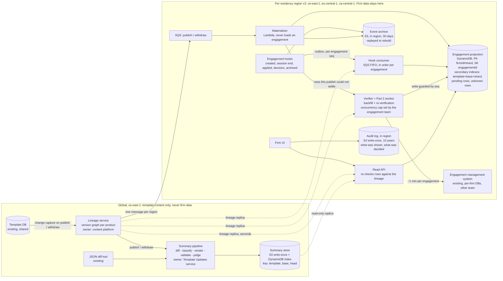

```mermaid
stateDiagram-v2
  [*] --> UNKNOWN : row seeded from the engagement list, base not yet confirmed
  UNKNOWN --> NONE : base confirmed, no eligible head
  UNKNOWN --> PENDING : base confirmed, an eligible newer head exists
  NONE --> PENDING : publish(T), T descends from the base on this branch, not declined
  NONE --> PENDING : publish(T), base withdrawn, T descends from its nearest published ancestor
  PENDING --> PENDING : publish(T2) newer than T, target and summary move to T2
  PENDING --> NONE : decline(T) logged; T and its ancestors back to the base are now covered
  PENDING --> NONE : withdraw(T), no other eligible target
  PENDING --> PENDING : withdraw(T), an older eligible target remains
  PENDING --> NONE : apply(T) confirmed by UpdateApplied or SessionEnded, base becomes T
  PENDING --> PENDING : apply(T) confirmed, a newer head already exists
```

# Pending Template Updates: Design

*Rates from `docs/design/cost-inputs.md` (AWS `us-east-1`, Anthropic pricing, 2026-09-19).*

## 1. Architecture and data ownership

This section decides where the data lives and who owns it.

A new **Template Updates service** adds one DynamoDB table per region, with one row per engagement file. The row records which template version that file sits on, and whether an update is waiting. The engagement system stays the source of truth.

Two facts force that shape. First, finding out which version a file is really on means loading it. Each load costs a minute of another team's capacity, so the publish path may never load one (§3, row 2). Second, template content is identical for every firm, so one summary of the v5-to-v7 change serves every file sitting on v5. Each product carries about 20,000 files (800,000 across 40 products), but those files sit on only about a dozen distinct versions. One publish therefore needs about a dozen summaries, not 20,000.

The table is a **projection**: a copy of a few facts about each file, kept current by events rather than by loading the file. The facts are the file's template, the version it is really on (its **effective base**), and the firm's accept and decline history. A publish updates a small global **lineage graph**, which records which template version descends from which. That update triggers a cheap recompute of the affected rows, in seconds. Only one component ever loads an engagement: the **verifier**, which is the Part 2 worker and runs under a concurrency cap. I commit the indicator to 60 seconds from publish rather than to seconds, and §5 argues why.

**Lineage graph** (new, global). One node per `(templateId, version)`, holding its parents, market, status and content hash. Change data capture feeds it from the template database's own write log, because code that commits and then emits an event loses a publish whenever the emit fails. The graph answers one question. On the base's own market branch, what is the newest published, non-withdrawn descendant of that base? That version is the file's **head**. To keep the answer unique, the lineage refuses a publish that would leave two heads on one branch, unless the new version merges them.

**Engagement projection** (new, one table per region). The key is `PK = firmId#shard`, `SK = engagementId`, with `shard = hash(engagementId) mod 16`.

| Attribute | Meaning |
|---|---|
| `templateId`, `market` | Which lineage branch this file is eligible for |
| `baseVersion` | Effective base: the creation version, replaced on a confirmed apply |
| `pendingTarget`, `state` | The head at the last recompute; `UNKNOWN`, `NONE` or `PENDING` (§2) |
| `decisions[]` | Append-only `{target, diffHash, summaryId, decidedAt, decidedBy}`, as sibling items |
| `lastSeq`, `lineageVersionApplied`, `unverified` | The two ordering guards of §2, plus a flag for a row whose events are overdue |

Three secondary indexes sit on the table. `templateId#baseVersion#shard` drives the fan-out, a `PENDING`-only index serves the file list, and an `UNKNOWN`-only index is the backfill queue. The shard keeps the largest firm off a single partition key. Take the worst case: all 40,000 of its files sit on one product. Sixteen shards split that publish into 2,500 writes per key, or 42 writes a second across the 60-second budget. DynamoDB allows 1,000 writes a second per key.

**Engagement system** (existing, the other team). I ask for six additive changes. Five are outbox hooks. An outbox hook is an event written in the same database transaction as the change it describes, so it cannot be lost. Each carries `seq`, a counter that rises by one per engagement. They are `EngagementCreated`, `SessionEnded(effectiveVersion)`, `UpdateApplied(newVersion)` for an apply made outside a session, `DecisionRecorded` and `EngagementArchived`. The sixth change adds `{target, summaryId, diffHash}` to their decision record, pinning at source what each decision was made against (§4).

**Publish flow.** The lineage sends one message per region. The **materializer** reads the fan-out index once per **live base**, meaning a template version that at least one engagement file still sits on. It expands the matches into SQS batches of ten rows: about 20,000 conditional writes, with no engagement loaded, guarded by `lastSeq` as in §2. A row it cannot settle, because that base is still `UNKNOWN`, goes to the verifier instead. The read API then serves the pending list from the `PENDING`-only index, re-checking each row against its copy of the lineage, so a withdrawn version disappears at the next page load. That re-check can only clear a pending flag, never set one, so a lost fan-out write stays quiet until the nightly recompute. Firm rows never leave their region. Summaries are the one thing held globally, because they hold no firm data (§4).

## 2. Correctness and production evolution

This section decides what a row may say about a file, and how it survives late or missing events. The projection may be stale, but it may never say "no updates" when it does not know, so `UNKNOWN` reads to the user as "checking".

Eligibility is descent on a market branch, never a version-number comparison, so a Canadian file is never offered a UK head. An accept is logged at once, but the row leaves `PENDING` only when the new base is confirmed. The decision endpoint refuses an accept of a version withdrawn after the page loaded.

**Accumulation and what "declined" pins.** If v4, v5 and v6 all publish before the user acts, the user sees one summary from the base to v6 and makes one decision. It is recorded against the exact pair of versions shown, here the base and v6. A decline pins nothing about the file, which stays on its base. It covers every version between the base and the target, because the summary the user read contained those changes. Otherwise declining v6 would expose v5 a second later, and the user would be asked three times about changes they read once.

The diff always starts from the file's actual base, so a declined v5 is never a diff origin. When v7 arrives carrying v5's changes, the row returns to `PENDING(v7)`. The summary carries a line assembled from the lineage and the decision log, not written by a model: "includes changes from v5, declined on 3 March". A firm that declines weekly is asked weekly, because a false "nothing pending" is the expensive error here.

**Withdrawal.** A withdrawal retargets affected rows inside the same 60-second budget. When a file's base is withdrawn, two different versions matter. Eligibility is recomputed from the nearest published ancestor of the withdrawn base, so the file is not stranded. The diff still starts from the version the file actually holds. Worked case: a firm sits on v6, v6 is withdrawn, and the fix v7 branches off v5. The firm is still offered v7, because v7 descends from v5. The summary it reads is the v6-to-v7 diff, because v6 is what the file contains.

**Unreliable and out-of-order delivery.** One producer is change data capture and the other is an outbox, so neither can lose an event at the source. Hook events travel an SQS FIFO queue, one ordered group per file. Each carries `seq`, and a write lands only if the row's counter is exactly one less. Why exactly one less, rather than merely higher? Under a "merely higher" rule, a decline carrying counter 6 that arrives behind a session end carrying counter 7 is rejected, and that decline vanishes in silence. Under "exactly one less", counter 7 waits until counter 6 lands. After ten minutes of waiting the row is flagged `unverified`.

Two writers touch a row: the materializer and the hook consumer. Both recompute `pendingTarget` and `state` from the same three inputs, which are the row's base, its decision log, and the lineage. A hook writer whose copy of the lineage is older than the row's `lineageVersionApplied` does not write. It waits a few seconds and retries with a fresher copy. A materializer write that fails its condition re-reads the row and recomputes. It never drops the row.

**Loss and drift.** A base changes only through an apply. An apply inside a session is re-stated at session end, and an apply outside one emits `UpdateApplied`, so neither can be lost. Reconciliation compares when each row was last confirmed against the engagement list's `lastOpenedAt`, and verifies only the mismatches.

**Migration and backfill, with no window.** Deploy the lineage, the empty tables and the hooks behind flags, one region and one product at a time. Every change is additive. Rollback is a flag that hides the indicator while the hooks keep writing, so the projection stays current and re-enabling needs no second backfill. Each seeded `UNKNOWN` row is written only where no row exists, so a seed never overwrites a live row.

Backfill then piggybacks on normal use, because every session end confirms a row for free. The verifier sweeps the rest, round-robin across firms. No firm may hold more than 5% of its region's slots while another firm in that region waits. The largest firm is 667 hours of one load slot on its own, so that cap stops it starving the other 3,999, and once they are done it takes every idle slot. The brief does not say how much spare capacity the engagement team has. I assume a grant of 50 concurrent loads, which I would negotiate before committing to a date. Split by file count, that is about 33 in `us-east-1` and 17 across the two others, making the backfill 11 days. At 25 concurrent loads it is 22.

A verifier result is not always safe to write back, because the user may apply an update during its one-minute load. So the enqueue carries `lastSeqAtEnqueue`, the write requires `lastSeq` to still equal it, and a stale result is discarded. Before loading, the verifier also re-reads the row and drops the job if `lastSeq` has moved or the row is no longer `UNKNOWN`, so a file the user opened meanwhile costs nothing. Both guards are part of the Part 2 contract.

## 3. Scale, cost and operational characteristics

This section decides the budget and shows the arithmetic. The feature costs about $280 a month, or $1,090 at worst, against a ceiling I propose at $2,500. Inference is 87% of the expected $280, and the bill turns on one summary per version pair rather than one per file.

| # | Quantity | Arithmetic | Result |
|---|---|---|---|
| 1 | Publishes/month; files/product | 40/week × 52 ÷ 12; 800,000 ÷ 40 | 173; 20,000 |
| 2 | Naive publish path (rejected) | 20,000 × 1 min | 333 downstream-hours; 3.3 h at 100-wide |
| 3 | Backfill capacity (one-off) | 800,000 × 1 min = 13,333 slot-hours ÷ 50 concurrent slots | 11 days |
| 4 | Backfill cost (one-off) | 800k seeds + 800k results = 1.6 M writes × 3 units × $0.625/M = $3. Summaries at 12 live bases: 40 × 12 = 480 pairs × $0.117 (= $0.080 generation + $0.037 judge, rows 7-8) = $56. At 52 live bases: 40 × 52 = 2,080 one-off pairs = $243 | $59–$246 |
| 5 | Fan-out writes | 173 publishes × 20,000 files = 3.46 M rows. A ~1 KB row (decision log in sibling items) costs 1 write unit on the table + 1 on the pending index. 6.9 M × $0.625/M | $4.3 |
| 6 | All other infrastructure | hook writes $5.6 (assume each file is opened ~3.75×/month — my figure, the brief gives no open rate — so 3 M events × 3 units × $0.625/M), SQS $4.9, Lambda $15.7, reads and storage $3.3, total $29.5. A third of files are in the EU and Canada, so +15% on that third = $1.5 | $31 |
| 7 | Generation, Sonnet 5 | 173 publishes × 12 live bases = 2,076, round to 2,080 summaries. Manifest of ~200 classified items at ~150 tokens each = 30k in; a ~1,500-word summary = 2k out. 30k × $2/M + 2k × $10/M = $0.080 each | $166 |
| 8 | Judge, Haiku 4.5 | judge re-reads manifest and summary (32k in), scores each sentence (1k out): 32k × $1/M + 1k × $5/M = $0.037 each, × 2,080 | $77 |
| 9 | **Expected total** | rows 5 + 6 + 7 + 8 | **≈ $278 / month** |
| 10 | Worst case: 52 live bases | 173 × 52 = 9,000 pairs × $0.117 = $1,053, plus $35 infrastructure (rows 5-6) | ≈ $1,090 / month |
| 11 | Per-file inference (rejected) | 3.46 M summaries × $0.080 | ≈ $277,000 / month |

Prompt caching and the Batch API are excluded, so rows 7 and 8 are upper bounds. The verifier's own compute rides the engagement team's existing fleet.

**Budget.** The brief leaves «$X» blank. I propose **$2,500 a month**, which is $0.60 per firm, nine times the expected bill and twice the worst case. At a $500 ceiling the expected $278 still fits and the worst case does not. The levers, in order: the Batch API at half price and a day's delay, then Haiku 4.5 for generation, then tighter manifest filtering.

**Service level objectives**, measured and paged.

- **Freshness.** From the publish commit to the moment the affected rows change: 99% within 60 seconds, in every region. A canary publishes and withdraws a reserved canary template every 15 minutes, against one synthetic row per region that is hidden from user-facing lists, and pages if that row has not flipped within 5 minutes.
- **Summaries.** 95% of live pairs rendered within 15 minutes and 100% within 2 hours, with the manifest shown meanwhile.
- **Projection health.** `UNKNOWN` plus `unverified` under 1% after backfill, and sampled drift under 0.1% over 30 days, from 200 random full loads a day. This is the only alarm that sees *silent* drift. A `NONE` row that is really eligible pages, because a firm may be skipping an evaluation it was obliged to make.
- **Capacity and politeness.** Verifier in-flight against the granted cap, failed-message queue depth, and daily inference spend stopped hard at twice expected. If engagement-open p99 rises more than 10% above baseline, the verifier halves its cap and pages.

**Failure recovery.** Materializer crash: SQS redelivers, and a rerun is harmless because the write is conditional. Verifier misfire: work is keyed on `(engagementId, trigger)`, so work already done is skipped on redelivery. An error that retrying cannot fix skips retries and goes straight to the dead-letter queue, a holding queue an operator reviews. Retrying those would be expensive, because five retries across 20,000 rows burn 1,667 hours of the engagement team's capacity. Projection loss: restore to a point in time, then replay the 30-day in-region event archive, never a 13,333-hour rebuild. Any outage shows "checking", never "none".

## 4. Human-readable summaries: generation and evaluation

This section decides how a summary is produced, checked, and kept defensible months later. The pipeline is: JSON diff, classifier, model renderer, deterministic validators, model judge, immutable record.

**Classifier.** It maps diff paths to what an auditor cares about and emits the **change manifest**, a numbered list of typed items, each with a materiality tag and a raw path. Cosmetic churn collapses to a count. This is the quality lever and the token lever at once, and it is ordinary unit-tested code.

For example, the diff path `/sampling/materiality` changing from 5 to 3 becomes manifest item 3, `THRESHOLD_CHANGED(materiality, 5%, 3%)`, tagged material. Claude Sonnet 5 renders that as: *"The materiality threshold for sampling falls from 5% to 3%, so more transactions will fall into scope. [3]"* The bracketed number is the manifest item, and clicking it shows the raw diff path.

**Renderer and checks.** Sonnet 5 writes up the material items for a non-technical auditor, under a fixed and versioned prompt, and may write nothing that is not in the manifest. Validators then check that every cited item exists, that every material item is cited, and that no number appears which the manifest lacks. Claude Haiku 4.5 judges each sentence for groundedness. It catches the misparaphrase validators cannot: a threshold called "raised" when it was lowered. One failure regenerates, and a second falls back to showing the manifest.

**Evaluation.** Offline, about 100 historical version pairs carry reference summaries from the content team. Outputs are scored on material-item coverage, unsupported-claim rate (zero tolerated), and an expert rating. No prompt or model change ships without beating the incumbent, enforced as a build gate. In production, 20 summaries a week are sampled for content-team review on the same rubric, and a week below the gate threshold blocks the next prompt change. A "was this accurate?" control is tied to the `summaryId`, and its free text stays in the firm's region as client data.

**November.** Each summary is written once and never edited. The record holds the text, its `summaryId`, the template, the base-and-head pair, a SHA-256 hash of the source diff, the classifier version, the prompt version, the model ID, the timestamp, and the validator and judge results. It goes to S3 under Object Lock, which is storage that refuses edits and deletes. It is kept ten years, my assumption for the longest statutory audit retention across our markets, to be confirmed with legal. A cache miss never regenerates in place. It writes a new record with a new ID.

Two pieces of evidence live outside the projection, because the projection is a copy that can be rebuilt and a rebuild must not touch them. They are the shown-log, one row of `(engagementId, summaryId, userId, shownAt)` per view, and every `DecisionRecorded` event. Both are appended to an in-region Object Lock bucket. So in November you can produce the text shown in March, the diff behind it, the model that wrote it, and evidence that this firm saw it before deciding.

## 5. Tradeoffs, assumptions, and the requirement I would challenge

This section names the tradeoffs, the assumptions, the requirement I would relax, the riskiest part, and what I cut.

**Key tradeoffs.**

- **Eventual consistency over authoritative reads.** Rows sit at `UNKNOWN` for days during backfill. Bought: the indicator never makes a user wait a minute.
- **Per-pair over per-file summaries.** Firm-specific phrasing becomes impossible. Bought: $166 a month instead of $277,000.
- **Re-offer over suppress on decline.** A firm that declines weekly is asked weekly. Bought: no hidden change a firm was obliged to evaluate.

**Assumptions I could not verify.** A1: the effective version is present in a rehydrated engagement, as it must be in order to apply an update, and can be emitted at session end. A2: the engagement system can cheaply list `(engagementId, firmId, productId, lastOpenedAt)`. A3: a decline needs no rehydrate, or bulk decline for the largest firm becomes a capacity job. A4: each file belongs to one market branch, inherited from its creation version.

**The requirement I would challenge: "within seconds."** I relax both halves openly rather than quietly missing them. The *indicator* gets 60 seconds at p99, from the publish commit to the row changing. An auditor's decision horizon is days, so 5 seconds buys nothing over 60, and forcing it would push a synchronous cross-region fan-out onto the publish path. The *summary* gets 15 minutes, with the manifest visible at once. Seconds there would put a model call of 20 to 60 seconds on the publish path for every pair, including pairs nobody reads. Withdrawal keeps the full 60 seconds, because that is where lateness harms someone.

**Riskiest to get wrong: the effective base version.** The engagement record stores the version the file was *created* from, and applying updates is out of scope here. After the first apply, the projection is the only place the effective base can be read without a one-minute load. The load itself still returns it, which is assumption A1, and both the verifier and the daily spot-checks depend on that. If A1 is false there is no repair path for already-applied files, and I would ask the engagement team to record the effective version at apply time. Drift here is invisible to every dashboard. One direction hides an update a firm had to evaluate. The other puts a wrong summary in front of a professional.

**Deliberately left out.** Firm-level and bulk decisions: the record accepts a `batchId`, but the policy is product's call, and the cut costs the largest firm about 1,000 decisions per publish (40,000 files across 40 products). Localisation: about 16 languages, my figure and not the brief's, would take the inference bill to roughly $3,900 a month. Per-region inference, which buys no compliance, because no firm data reaches a model. Notifications, the UI, access control and the apply mechanism are out of scope per the brief.
