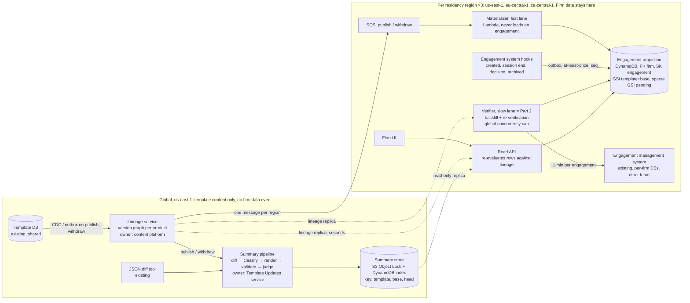
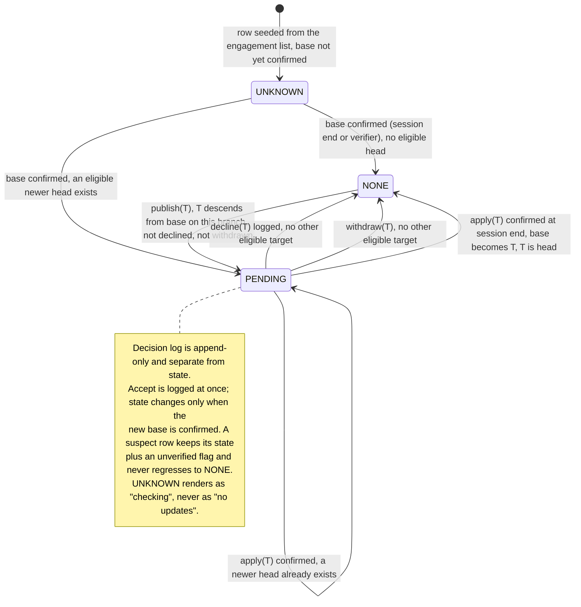

# Pending Template Updates: Design

*Part 1 of the take-home. Rates are from `docs/design/cost-inputs.md` (AWS `us-east-1` bulk price list and Anthropic published pricing, 2026-09-19). Diagrams are excluded from the page count.*

## 0. Decisions, and the three numbers that force them

**Decisions.** A durable, per-region **projection** of `(engagement, template, effective base version, decision log)` is built once and then maintained by events. Publishing a template never loads an engagement: it updates a small global **lineage graph** and fans out a recompute over projection rows, in seconds, for cents. The one-minute engagement load runs in exactly one place, a rate-limited **verifier** that does the backfill and afterwards re-checks only rows the system distrusts; that verifier is the Part 2 worker. Human-readable summaries are generated once per `(template, base → head)` pair, never per engagement, from a deterministic diff, validated against that diff, and stored immutably for ten years. "Declined" suppresses one target version, not the engagement, so a later version carrying new content is offered again with the earlier decision shown.

**The numbers.** Three calculations were done before any box was drawn.

- *Never touch an engagement on publish.* 800,000 engagements ÷ 40 products ≈ 20,000 per product. Loading each one to read its version is 20,000 × 1 min = **333 downstream-hours per publish**, ~40 times a week, taken from the pods that serve every user's opens and decisions. At 100-way concurrency it is still 3.3 hours against a target of seconds.
- *Price inference per version pair, never per engagement.* Template content is not firm-specific, so a summary of `base → target` is identical for every engagement on that pair in every firm. A publish touches ~20,000 engagements but only ~12 distinct live base versions (assumed), so one summary is reused ~1,700 times. That is the gap between ~$166 and ~$277,000 a month (§3).
- *Backfill is paid in another team's capacity.* The only way to learn an existing engagement's version is to load it: 800,000 × 1 min = **13,333 slot-hours**, 11 days on 50 borrowed slots. The design has to shrink that, share it fairly across 4,000 firms, and be honest in the UI while it runs.

## 1. Architecture and data ownership

Three data classes, three owners; the region boundary follows the data. Template content is global. Engagement content never leaves the engagement store. An engagement ID plus its version and pending state is derived metadata, but I treat it as firm data and keep it in the firm's region (`us-east-1`, `eu-central-1`, `ca-central-1`, routed by the existing firm-to-region mapping). Nothing flows region → global. What flows global → region is lineage and summaries, which contain no firm data.

**Template lineage graph** (new, global; owned by the content platform). One node per `(templateId, version)` with `parents[]`, `market`, `status ∈ {PUBLISHED, WITHDRAWN}`, `contentHash`. Captured by CDC or a transactional outbox on the template database's own publish and withdraw writes, not by application code that commits and then emits, which loses the event whenever the second step fails. It answers one question: `head(templateId, base, market)`, the newest published, non-withdrawn descendant of `base` on the market's branch. At 40 products × ~50 versions a year it fits in every reader's memory and refreshes within seconds.

**Engagement projection** (new, one DynamoDB table per region; owned by the new Template Updates service; derived from the engagement system, which stays the source of truth). Keyed `PK=firmId, SK=engagementId`, one row per active engagement:

| Attribute | Meaning |
|---|---|
| `templateId`, `market` | The lineage this engagement is eligible for |
| `baseVersion`, `baseSource`, `lastVerifiedAt` | Effective base: the creation version, replaced when an apply is confirmed. Source is CREATE, SESSION_END or BACKFILL |
| `pendingTarget` | `head(templateId, baseVersion, market)` at last recompute, or null |
| `state` | `UNKNOWN`, `NONE`, `PENDING` (§2) |
| `decisions[]` | Append-only: `{target, diffHash, summaryId, decidedAt, decidedBy}` |
| `lastSeq`, `lineageVersionApplied`, `unverified` | Idempotency guards for the two write paths; drift flag |

Two indexes: a keys-only GSI on `templateId#baseVersion` serves the publish fan-out, and a sparse GSI on `firmId` for rows in `PENDING` makes "which of my files have pending updates" one query even for the 40,000-engagement firm, with a per-firm counter row for the badge. The row holds identifiers, versions and decisions only. It never holds engagement content, financial fields, the diff or the summary text: the first two never leave the engagement store, the last two are global by construction. Nothing in this table reaches a model.

**Diff and summary store** (new, global; owned by the Template Updates service). One immutable record per `(templateId, base, head)`: the deterministic JSON diff, the classified change manifest, the prose, and provenance (§4). S3 with Object Lock plus a DynamoDB index, produced once in `us-east-1`, replicated read-only to the other regions, retained ten years, the longest audit-file retention we serve.

**Engagement management system** (existing, per-firm databases; the other team). Remains the source of truth for the engagement, its effective template version and every decision. I ask that team for four additive hooks, emitted at-least-once through their outbox with a per-engagement monotonic `seq`: `EngagementCreated`, `DecisionRecorded(accept | decline)`, `SessionEnded(effectiveVersion)`, `EngagementArchived`. The session-end hook is the one that matters (§2).

**Publish flow.** Outbox event → lineage updated → one SQS message per region → the **materializer** (fast lane) queries the fan-out index for each live base and flips `pendingTarget` and `state` on affected rows: ~20,000 conditional writes, no engagement-system involvement. In parallel the summary pipeline generates one record per live `base → head` pair. The read API serves the pending list from the sparse index and re-evaluates each returned row against the in-memory lineage as it reads, so a withdrawal disappears at the next read even before the materializer reaches the row. The 40,000-file firm is not a hot partition: one publish touches its share of one product, ~1,000 rows.

**The one-minute load** happens in exactly one place: the **verifier** (slow lane), which does the backfill and re-verifies rows the system distrusts (§2). It never gates the indicator, it runs under a global concurrency cap negotiated with the engagement team, and it is the Part 2 worker.

## 2. Correctness and production evolution

**Versions are a graph.** An engagement is eligible for target T only if T is a published, non-withdrawn descendant of its base on the same market branch; the pending target is the newest such head. No integer or semver comparison exists anywhere, so an engagement created from the Canadian branch is never offered a UK head.

**Accumulation: one decision, base → head.** If v4, v5 and v6 arrive before the user acts, they see one summary for `base → v6` and make one decision. The diff is always computed from the engagement's actual base, never from a version it declined, because it is not on that version. If a newer head lands while the summary is open, the decision is recorded against the pair the user saw and the indicator re-raises for the new head.

**What "declined" pins.** Nothing about the engagement: it stays on its base. A decline records `{target, diffHash, summaryId, who, when}` and suppresses that target only. When v7 arrives carrying v5's changes, the row returns to `PENDING(v7)`, the summary is for `base → v7`, and the UI adds a deterministic line, "includes changes from v5, declined on 3 March by J. Smith", computed from `ancestors(v7) ∩ decisions`, not by the model. A firm that declines weekly is asked weekly. I accept that: suppressing v7 because v5 was declined hides content the firm never evaluated, and in audit the false "nothing pending" is the expensive error. Accepting is logged immediately; the state changes only when the new base is confirmed at session end.

**Withdrawal.** The lineage marks the node withdrawn; readers exclude it within seconds and the materializer retargets affected rows within the same freshness budget as a publish. Its summary records are kept but marked `WITHDRAWN`. An engagement that already applied it is flagged `baseWithdrawn` and becomes `PENDING` once a replacement ships. Decisions are never deleted.

**Unreliable delivery.** Both event sources are outboxes, so nothing is lost at the producer. SQS standard delivers at least once and out of order; the projection applies every event with a conditional write (`lastSeq < :seq` for engagement events, `lineageVersionApplied < :lv` for fan-out writes), so a duplicate or a replay is a no-op. One invariant makes loss survivable: **an engagement's base can only change while it is loaded, and every session end emits the effective version.** A lost apply self-heals at the next open; an unopened engagement cannot have drifted. Reconciliation compares two cheap fields, the projection's `lastVerifiedAt` and the engagement list's `lastOpenedAt`, and queues a one-minute verification only for mismatches, gaps in `seq`, and engagements missing from the projection. A suspect row keeps its state, is flagged `unverified`, and never regresses to `NONE`. A nightly recompute of every row against the lineage (pure DynamoDB, cents) catches a missed fan-out.

**Two lanes, one publish, and where Part 2 sits.** The materializer flips every row it trusts in seconds, so the badge is already up. Rows on the affected lineage that are `UNKNOWN` or `unverified` are queued to the verifier, which loads each one, confirms the base, and recomputes; during backfill or after a hook outage that is a large number of engagements per publish. Part 2 implements that verifier. It is the half of the fan-out that can tolerate minutes because the indicator does not wait for it.

**Migration and backfill, no window.** (1) Deploy the lineage service and load the graph from the template DB, minutes; deploy empty projection tables and the four hooks behind flags, UI off. (2) Seed one `UNKNOWN` row per active engagement from each firm's engagement list; from this moment the UI can show "checking". (3) Backfill by piggyback first: every session end confirms a row for free, so the files users actually work in fill themselves in within days. Then the verifier sweeps files not opened since the hook went live, most recently active first, round-robin across firms with a 5% per-firm slot cap, so the 40,000-file firm (667 slot-hours on its own) cannot starve the other 3,999. The work queue is the sparse `UNKNOWN` index itself: a restart is a rescan, and confirming a row twice is harmless. (4) Shadow (indicators computed, 200 spot-checks a day against full loads, no UI), then pilot firms by flag, then general availability per region, with the fan-out enabled on a canary product first. Rollback at any step is a flag, accumulated state is kept, and schema changes are additive only.

## 3. Scale, cost and operational characteristics

| # | Quantity | Arithmetic | Result |
|---|---|---|---|
| 1 | Publishes per month | 40 per week × 52 ÷ 12 | 173 |
| 2 | Engagements per product | 800,000 ÷ 40 | 20,000 |
| 3 | Naive publish path (rejected) | 20,000 × 1 min | 333 downstream-hours; 3.3 h at 100-wide |
| 4 | Backfill | 800,000 × 1 min | 13,333 slot-hours; 11 days at 50 slots |
| 5 | Fan-out writes | 173 × 20,000 × 3 (table + 2 indexes) = 10.4 M WRU × $0.625/M | $6.5 |
| 6 | Hook writes | ~3 M session events × 3 WRU = 9 M × $0.625/M | $5.6 |
| 7 | SQS | (3 M + 3.46 M) × 3 requests = 19.4 M × $0.40/M | $7.8 |
| 8 | Lambda | 7 M × $0.20/M + 7 M × 0.25 s × 0.5 GB = 875k GB-s × $0.0000133 | $13.1 |
| 9 | Reads and storage | 5 M queries × 8 RRU = 40 M × $0.125/M; 2.4 GB × $0.25; 1.3 GB × $0.023 | $5.6 |
| 10 | EU / CA regional premium | +15% on the in-region share (~$25) | $3.8 |
| 11 | Summaries per month | 173 publishes × 12 live bases | 2,080 |
| 12 | Generation, Sonnet 5 | 2,080 × (30k in × $2/M + 2k out × $10/M) = 2,080 × $0.080 | $166 |
| 13 | Judge, Haiku 4.5 | 2,080 × (32k in × $1/M + 1k out × $5/M) = 2,080 × $0.037 | $77 |
| 14 | **Expected total** | rows 5 to 10, 12, 13 | **≈ $285 / month** |
| 15 | Worst case: 52 live bases (nobody ever applies) | 9,000 pairs × $0.117 + $42 | ≈ $1,100 / month |
| 16 | Per-engagement inference (rejected) | 3.46 M × $0.080 | ≈ $277,000 / month |

The one-off backfill costs under $5 on our side plus $56 to $243 of inference (480 to 2,080 historical pairs, 12 or 52 live bases per product, judge included). Its real price is 13,333 hours of another team's capacity, which is a negotiation, not a line item.

**Budget.** The brief leaves «$X» blank. I propose **$2,500 a month**, about $0.60 per firm: ~9× expected spend and ~2× the worst case, tight enough that the levers below mean something. Inference is 85% of the bill and is decided by one choice; per engagement instead of per pair, the same feature costs $277,000. If «$X» turns out to be $500, the levers in order: the Batch API (−50% on generation, at the cost of a day rather than 15 minutes for the summary, with the manifest visible immediately), Haiku 4.5 for generation (−50% again), then tighter manifest filtering. None changes the architecture. Opus 5 would cost $416 for generation, so the model tier is a quality decision for the evaluation set, not a budget one. Localisation is the one addition that would force a budget conversation (§5).

**SLOs**, each measured and paged:

- Indicator and withdrawal freshness: template-DB commit to projection flip, p99 ≤ 60 s per region, measured by a canary publish on a test product every 15 minutes; page at 5 minutes.
- Summary availability: 95% of live pairs within 15 minutes, 100% within 2 hours; otherwise the manifest table is shown.
- Projection health: `UNKNOWN` plus `unverified` < 1% after backfill, alert on rising. Sampled drift < 0.1% over a rolling 30 days, from 200 random full loads a day (200 minutes of borrowed capacity). This is the only alarm that can see *silent* drift; queue depth cannot. Any sampled false negative (projection says `NONE`, engagement says an update is eligible) pages, because it means a firm may skip an evaluation it was obliged to make.
- Capacity and spend: verifier in-flight calls against the cap, DLQ depth per lane, and daily inference with a hard stop at 2× expected. An outage is safer than a bill.

**Failure recovery, by blast radius.**

- Materializer crash mid-publish: SQS redelivers, writes are idempotent, and materialization is a pure function of (row, lineage), so any publish can be rerun from the lineage. Cost: seconds of staleness.
- Verifier misfires: a duplicate delivery is a duplicate one-minute call, so the verifier keys on `(engagementId, trigger)` and skips completed work. A non-retryable error retried 5× across 20,000 rows would waste 1,667 downstream-hours, so those go straight to the DLQ; retryable ones back off with jitter under a per-publish retry budget, and the global cap bounds the worst case.
- Lineage service down, or a mislabelled branch: publishes queue and badges lag (alert), reads are unaffected. A wrong branch is fixed and rerun; decisions made meanwhile stay recorded against what was shown.
- Inference outage or budget stop: the indicator is unaffected; the manifest is shown until generation resumes.
- Projection table loss: point-in-time recovery, then replay of the 30-day event archive from S3, never a 13,333-hour rebuild. A regional outage returns "checking", never "none"; decisions are still processed by the engagement system and replay in.

## 4. Human-readable summaries: generation and evaluation

**Pipeline:** deterministic JSON diff (existing tool) → deterministic classifier → LLM renderer → deterministic validators → LLM judge → immutable record.

The classifier maps diff paths to what an auditor cares about and emits a **change manifest**: a numbered list of typed items such as `PROCEDURE_ADDED`, `THRESHOLD_CHANGED(old, new)`, `DISCLOSURE_ITEM_REMOVED`, each with a materiality tag and the raw path; cosmetic churn is collapsed to a count. It is the quality lever and the token lever, and it is unit-testable.

Claude Sonnet 5 renders the material items into prose for a non-technical auditor under a fixed prompt version, citing manifest IDs inline and writing nothing that is not in the manifest. Validators check, deterministically, that every cited ID exists, every material item is cited, and no number appears that is not in the manifest. Claude Haiku 4.5 then judges each sentence for groundedness against the manifest, which catches the misparaphrase the validators cannot: a threshold "raised" when it was lowered. One failure triggers one regeneration; a second renders the manifest itself as a table and flags the pair for content-team review. Summaries are generated eagerly at publish for every live base on the lineage and lazily on a miss, with the badge already up. The model never sees engagement content and never sits between the practitioner and the decision: the manifest and raw diff are one click away.

**Evaluation.** Offline: a golden set of ~100 historical pairs with reference summaries written by the content team, scored on material-item coverage, unsupported-claim rate (zero tolerated) and SME rating; no prompt or model change ships without beating the current version, enforced as a CI gate. Online: validators and judge on 100% of outputs (priced in §3); the content team that published the update reviews the single-hop `parent → head` summary as part of their publish, because they know what they changed; multi-hop summaries are sampled at 5% a week for the same review; a "was this accurate?" control is tied to the `summaryId`. Reviews are appended to the record, not a gate on display.

**November.** A summary is an audit artifact, not a cache entry. The record is `{summaryId, templateId, base, head, SHA-256 of the diff, classifier version, prompt version, model ID, timestamp, text, validator results, judge verdict, reviews}`, written once to S3 with Object Lock and 10-year retention. The UI logs `(engagementId, summaryId, userId, shownAt)` in region, and every decision stores the `summaryId` it was made against. A cache miss never regenerates in place; it creates a new record with a new ID. In November you can produce the exact text shown in March, the diff it came from, and the model that wrote it, and a retired model changes nothing.

## 5. Tradeoffs, assumptions, the challenge, the risk, and what was left out

**Assumptions, and what breaks if they are wrong.**

- A1. "Active" means the 800,000; archived files are excluded from backfill and get a row on reactivation.
- A2. The effective version is present in the rehydrated engagement (it must be, to apply an update) and can be emitted at session end. If not, drift detection falls back to sampling alone.
- A3. The engagement system can list `(engagementId, firmId, productId, lastOpenedAt)` cheaply; the file-list UI already needs this. If not, a whole firm shows "checking" until backfilled, at the same total cost.
- A4. An engagement belongs to one market branch, inherited from its creation version.
- A5. ~12 live bases per product; sensitivity to 52 in §3.
- A6. Recording a decline does not require rehydrating the engagement. If it does, bulk decline for the 40,000-file firm is a multi-day capacity job, not a UI feature.
- A7. Summaries in the template's authoring language only; a firm-to-home-region mapping exists.

**The requirement I would challenge: "within seconds."** It is really two requirements. The *indicator* within seconds is nearly free (lineage propagation plus a projection flip), so I keep it, and it is the right target for withdrawals. The *summary* within seconds puts a 20 to 60 second model call on the publish path for every pair, including pairs nobody will read, forbids the Batch API, and leaves no room for the groundedness gate, all for text a human reads minutes to days later as part of a days-scale decision. I commit to indicator p99 ≤ 60 s and summary within 15 minutes, with the manifest visible immediately. Same outcome for the user, and the gate stays.

**Riskiest to get wrong: the effective base version.** The stored field is the *creation* version and applying is out of scope, so after the first apply the projection is the only queryable place the effective base lives. Pending target, diff, summary and the auditor's decision are all computed from that one field, and drift in it is invisible to any queue or latency dashboard. In one direction it hides an update a firm was obliged to evaluate; in the other it puts a wrong summary in front of a professional. The defences, in order: the session-end invariant, `lastOpenedAt` reconciliation, `UNKNOWN` ≠ `NONE`, and 200 ground-truth loads a day. If I could keep only one, it is the session-end hook.

**Deliberately left out.**

- Firm-level or bulk decisions for the 40,000-file firm. The decision record accepts a `batchId`; the policy and UX are product's. Cost of the cut: ~1,000 individual decisions per publish for that firm.
- Hunk-level decline pinning (suppressing only the specific changes already declined): better UX, but it needs stable change identity from the diff tool, which I have not verified exists.
- Localisation. 16 languages would multiply inference by up to 16× (~$3,900 a month with the judge), over the proposed budget and pointless until product names the locales.
- Per-region inference. No firm data reaches the model, so it buys no compliance.
- Notifications, the UI itself, IAM detail, and the apply mechanism, which the brief places out of scope.
