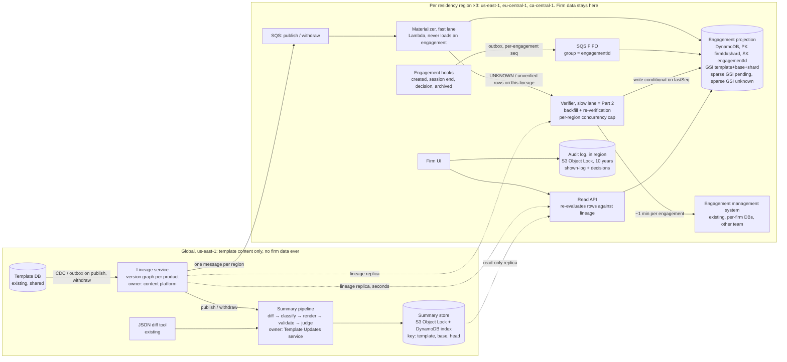
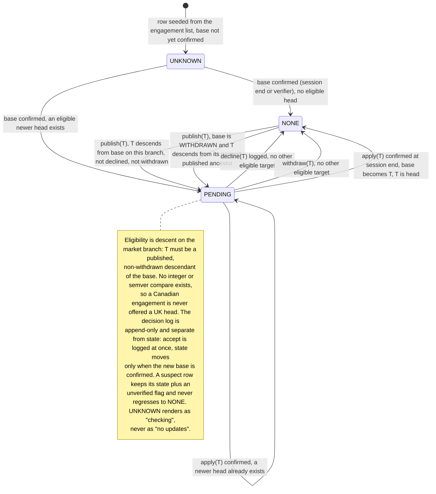

# Pending Template Updates: Design

*Rates from `docs/design/cost-inputs.md` (AWS `us-east-1`, Anthropic published pricing, 2026-09-19). NNNN words excluding diagrams.*

## 1. Architecture and data ownership

Two facts decide the shape. Reading an engagement's effective template version means loading it — a minute of another team's capacity — so the publish path must never load one (§3, row 3). And template content is not firm-specific: a `base → head` summary is identical for every engagement on that pair, and a publish spans only ~12 **live bases** (versions at least one engagement is currently sitting on, per product; A5), so each is reused ~1,700 times — the difference between $166 and $277,000 a month.

So: a durable per-region **projection** of `(engagement, template, effective base, decision log)`, maintained by events. A publish updates a small global **lineage graph** and fans out a recompute over projection rows — seconds, cents, no engagement loaded. The one-minute load happens in exactly one place, a rate-limited **verifier** that runs the backfill and afterwards re-checks only distrusted rows; it is the Part 2 worker.

**Lineage graph** (new, global; content platform). One node per `(templateId, version)` with `parents[]`, `market`, `status`, `contentHash`, captured by CDC or outbox on the template DB's own writes, not by commit-then-emit application code. It answers `head(templateId, base, market)`: the newest published, non-withdrawn descendant of `base` on that branch. It enforces one invariant: at most one published, non-withdrawn leaf per `(templateId, market)`, rejecting a second unless it is a merge node with both as parents, since two leaves strand whichever firms applied the other.

**Engagement projection** (new, one DynamoDB table per region; Template Updates service owns it, the engagement system stays source of truth). Keyed `PK=firmId#shard, SK=engagementId`, `shard = hash(engagementId) mod 16`:

| Attribute | Meaning |
|---|---|
| `templateId`, `market` | The lineage this engagement is eligible for |
| `baseVersion`, `baseSource`, `lastVerifiedAt` | Effective base: creation version, replaced when an apply is confirmed. Source CREATE, SESSION_END, BACKFILL |
| `pendingTarget` | `head(templateId, baseVersion, market)` at last recompute, or null |
| `state` | `UNKNOWN`, `NONE`, `PENDING` (§2) |
| `decisions[]` | Append-only `{target, diffHash, summaryId, decidedAt, decidedBy}` |
| `lastSeq`, `lineageVersionApplied`, `unverified` | Ordering guards for the two writers; drift flag |

Three indexes: keys-only on `templateId#baseVersion#shard` for the fan-out; sparse on `firmId#shard` over `PENDING` rows for the file list and badge; sparse on `firmId#shard` over `UNKNOWN` rows as the backfill queue. The shard keeps the 40,000-engagement firm off one partition key: a publish spreads its ~1,000 writes over 16 keys (~60 each, against DynamoDB's hard 1,000 WCU/s per key), and the badge is 16 parallel reads. The row is derived, but it is firm data: it stays in region and holds identifiers, versions and decisions only — never engagement content, financial fields, the diff or the summary text. Nothing in it reaches a model; region → global carries only anonymous counters (§4).

**Diff and summary store** (new, global). One immutable record per `(templateId, base, head)`: the deterministic JSON diff, the **change manifest** (a numbered list of typed, classified changes — the deterministic backbone the prose is rendered from and validated against, §4), the prose, and provenance. S3 Object Lock plus a DynamoDB index, written once globally, replicated read-only per region, retained ten years (A8).

**Engagement system** (existing; the other team) stays source of truth for the engagement, its effective version and every decision. I ask for five additive changes through their outbox, each carrying a per-engagement monotonic `seq`: hooks `EngagementCreated`, `DecisionRecorded`, `SessionEnded(effectiveVersion)`, `EngagementArchived`, plus `{target, summaryId, diffHash}` on their decision record and its hook, pinning at the source of truth the artifact a decision was made against (§4).

**Publish flow.** Outbox event → lineage updated → one SQS message per region → the **materializer** queries the fan-out index per live base and expands the work into SQS batches of ten rows, so 16 shards absorb the burst: ~20,000 conditional writes, no engagement loaded. The read API serves the pending list from the sparse index and re-evaluates each row against the in-memory lineage as it reads, so a withdrawal disappears at the next read. That re-evaluation can only demote; promotion happens only through writes, so a lost fan-out write is bounded by the nightly recompute (≤24 h) and the freshness SLO covers the fan-out path alone. A second fan-out pass 60 s later over rows with `lineageVersionApplied < :lv` catches rows seeded meanwhile from a lagging lineage replica.

## 2. Correctness and production evolution

**Accumulation: one decision, base → head.** If v4, v5 and v6 arrive before the user acts, they see one summary for `base → v6` and make one decision. The diff always starts from the engagement's actual base. Declining v5 never moved the engagement onto v5, so v5 is never a diff origin: the v7 summary is `base → v7`. If a newer head lands while the summary is open, the decision is recorded against the pair the user saw and the indicator re-raises.

**What "declined" pins.** Nothing about the engagement: it stays on its base, and the decline records `{target, diffHash, summaryId, who, when}` and suppresses that target only. When v7 arrives carrying v5's changes the row returns to `PENDING(v7)` and the UI adds a deterministic line — "includes changes from v5, declined on 3 March by J. Smith" — from `ancestors(v7) ∩ decisions`, not from the model. A firm that declines weekly is asked weekly: suppressing v7 would hide content the firm never evaluated, and in audit the false "nothing pending" is the expensive error.

**Withdrawal.** The lineage marks the node withdrawn; readers exclude it within seconds and the materializer retargets affected rows inside the publish freshness budget. Withdrawing a node does not withdraw its descendants — the content team withdraws those explicitly when the defect propagated — so a fix usually branches from the withdrawn node's parent. An engagement whose base is withdrawn is therefore evaluated against `head(templateId, nearestPublishedAncestor(base), market)`, any result offered as pending with diff and summary from the actual base (`v6 → v7`; the diff tool compares any two versions). Without that rule a firm on a withdrawn v6 is told "no pending updates" forever, because the fix v7 branches off v5 and does not descend from v6.

**Unreliable and out-of-order delivery.** Both sources are outboxes, so nothing is lost at the producer. Engagement hooks ride SQS FIFO, `MessageGroupId = engagementId`, `MessageDeduplicationId = engagementId#seq`, applied conditional on `lastSeq = :seq - 1` — strict successor, not `<`. Last-writer-wins would silently drop a decline of v5 arriving behind the session-end at seq+1, leaving the row pending on an update the user just declined and with no `decisions[]` entry to surface under v7. A gap returns the message with a delay, flagging the row `unverified` only if it persists past ten minutes. One rule governs the two writers: hook handlers write `baseVersion`, `baseSource`, `decisions[]` and `lastSeq` only, never `lineageVersionApplied`, and recompute `pendingTarget`/`state` as a pure function of (base, decisions, lineage at `max(replica, row.lineageVersionApplied)`), refusing to write when their replica is behind the row — otherwise a stale handler drags back a target the materializer already flipped forward.

**Loss and drift.** One invariant makes loss survivable: an engagement's base can only change while it is loaded, and every session end emits the effective version, so a lost apply self-heals at the next open and an unopened engagement cannot have drifted. Reconciliation compares the projection's `lastVerifiedAt` with the engagement list's `lastOpenedAt`, queueing a one-minute verification only for mismatches, `seq` gaps and missing engagements. A nightly recompute against the lineage (pure DynamoDB, cents) catches a missed fan-out.

**Migration and backfill, no window.** Deploy lineage, empty projection tables and the hooks behind flags, UI off; seed one `UNKNOWN` row per active engagement from each firm's engagement list, after which the UI shows "checking". Backfill piggybacks first — every session end confirms a row for free — then the verifier sweeps unopened files, most recently active first, round-robin with a 5% per-firm slot cap so the 40,000-file firm (667 slot-hours alone) cannot starve the other 3,999. A verifier result is not unconditionally safe to write: if the user opens and applies during its one-minute load, writing back resurrects a stale base and offers an update the file already has. So the enqueue carries `lastSeqAtEnqueue` and the write is conditional on `lastSeq = :lastSeqAtEnqueue`, discarded on failure because a newer hook already confirmed the row. That guard is part of the Part 2 contract and covers re-verification after a hook outage too. Then shadow mode (200 daily spot-checks against full loads), pilot firms, GA per region, canary product first; rollback is a flag and schema changes are additive.

## 3. Scale, cost and operational characteristics

| # | Quantity | Arithmetic | Result |
|---|---|---|---|
| 1 | Publishes per month | 40/week × 52 ÷ 12 | 173 |
| 2 | Engagements per product | 800,000 ÷ 40 | 20,000 |
| 3 | Naive publish path (rejected) | 20,000 × 1 min | 333 downstream-hours; 3.3 h at 100-wide |
| 4 | Backfill | 800,000 × 1 min | 13,333 slot-hours; 11 days at 50 slots |
| 5 | Fan-out writes | 173 × 20,000 = 3.46 M rows × 3 WRU (table + fan-out + pending index; `UNKNOWN` is sparse, empty after backfill) = 10.4 M × $0.625/M | $6.5 |
| 6 | Hook writes | 3 M session events × 3 WRU = 9 M × $0.625/M | $5.6 |
| 7 | SQS | hooks 3 M × 3 = 9 M FIFO × $0.50/M; fan-out 346k × 3 = 1.0 M × $0.40/M | $4.9 |
| 8 | Lambda | 8.4 M × $0.20/M + 8.4 M × 0.25 s × 0.5 GB = 1.05 M GB-s × $0.0000133 | $15.7 |
| 9 | Reads and storage | 40 M RRU × $0.125/M; 2.4 GB × $0.25; 1.3 GB × $0.023 | $5.6 |
| 10 | EU / CA premium | +15% on the in-region third (~$13) | $1.9 |
| 11 | Summaries per month | 173 publishes × ~12 live bases on the published product | 2,080 |
| 12 | Generation, Sonnet 5 | 2,080 × (30k in × $2/M + 2k out × $10/M) = 2,080 × $0.080 | $166 |
| 13 | Judge, Haiku 4.5 | 2,080 × (32k in × $1/M + 1k out × $5/M) = 2,080 × $0.037 | $77 |
| 14 | **Expected total** | rows 5-10, 12, 13 | **≈ $283 / month** |
| 15 | Worst case: 52 live bases | 9,000 pairs × $0.117 + $40 | ≈ $1,100 / month |
| 16 | Per-engagement inference (rejected) | 3.46 M × $0.080 | ≈ $277,000 / month |

*Rows 6-10 rest on assumptions, not brief constants: 800,000 engagements opened ~3.75×/month → ~3 M session events; the materializer expands one per-region publish message into SQS batches of ten → 346k messages; Lambda ≈ 3 M hooks + 0.35 M fan-out + 5 M read-API = 8.4 M; ~5 M pending-list queries at 8 RRU (a 32 KB eventually-consistent page); projection row ~3 KB with decision history → 2.4 GB; summaries 2,080 × ~50 KB × 12 → 1.3 GB/year, plus a negligible in-region audit bucket (§4). I assume a third of engagements sit in EU+CA → ~$13 in region, and take 15%, the top of the `cost-inputs.md` band, as the conservative end.*

**Budget.** The brief leaves «$X» blank. I propose **$2,500 a month**: roughly 1% of what serving 4,000 firms already costs on existing platform spend, the ceiling below which a feature this size needs no business case. (Absent that figure, the anchor is $0.60 per firm per month, about one practitioner-minute a week of the decision time this saves.) That is ~9× expected and ~2× worst case. Inference is 85% of the bill and turns on one choice: per engagement instead of per pair costs $277,000. If «$X» is $500, the levers are the Batch API (−50%, a day rather than 15 minutes), then Haiku 4.5 for generation (−50% again), then tighter manifest filtering; none changes the architecture. Backfill adds a one-off <$5 of infrastructure and $56-$243 of inference; its real price is 13,333 hours of another team's capacity, a negotiation rather than a line item.

**SLOs**, each measured and paged.

- Indicator and withdrawal freshness: template-DB commit to projection flip, p99 ≤ 60 s per region, from a canary publish every 15 minutes; page at 5 minutes. Covers the fan-out path only; a missed write is bounded by the nightly recompute.
- Summary availability: 95% of live pairs within 15 minutes, 100% within 2 hours; otherwise the manifest is shown as a table.
- Projection health: `UNKNOWN` plus `unverified` < 1% after backfill; sampled drift < 0.1% over 30 days from 200 random full loads a day. This is the only alarm that sees *silent* drift; queue depth cannot. A sampled false negative (projection `NONE`, engagement eligible) pages: a firm may be skipping an evaluation it was obliged to make.
- Capacity and spend: verifier in-flight calls against the per-region cap, DLQ depth per lane, daily inference with a hard stop at 2× expected. An outage is safer than a bill.

**Failure recovery.** Materializer crash mid-publish: SQS redelivers and materialization is a pure function of (row, lineage), so any publish reruns from the lineage, costing seconds of staleness. Verifier misfire: it keys on `(engagementId, trigger)` in a per-region idempotency store and skips completed work, and non-retryable errors go straight to the DLQ, since 5 retries across 20,000 rows waste 1,667 downstream-hours. Lineage down or a branch mislabelled: publishes queue and badges lag (alert), reads unaffected, decisions stay recorded against what was shown. Inference outage or budget stop: the indicator is unaffected and the manifest is shown. Projection loss: PITR plus replay of the 30-day event archive, never a 13,333-hour rebuild; a regional outage returns "checking", never "none".

## 4. Human-readable summaries: generation and evaluation

**Pipeline:** deterministic JSON diff (existing tool) → deterministic classifier → LLM renderer → deterministic validators → LLM judge → immutable record.

The classifier maps diff paths to what an auditor cares about and emits the change manifest: typed items such as `PROCEDURE_ADDED`, `THRESHOLD_CHANGED(old, new)`, `DISCLOSURE_ITEM_REMOVED`, each with a materiality tag and the raw path; cosmetic churn collapses to a count. It is the quality lever and the token lever at once, and it is unit-testable.

Claude Sonnet 5 renders the material items into prose for a non-technical auditor under a fixed prompt version, citing manifest IDs inline and writing nothing outside the manifest. Validators check deterministically that every cited ID exists, every material item is cited, and no number appears that the manifest does not contain. Claude Haiku 4.5 then judges each sentence for groundedness, catching the misparaphrase validators cannot: a threshold "raised" when it was lowered. One failure triggers one regeneration; a second renders the manifest as a table and flags the pair for content-team review. Generation is eager at publish for every live base, lazy on a miss, with the badge already up. The model never sees engagement content and never sits between the practitioner and the decision: manifest and raw diff are one click away.

**Evaluation.** Offline: ~100 historical pairs with content-team reference summaries, scored on material-item coverage, unsupported-claim rate (zero tolerated) and SME rating; no prompt or model change ships without beating the incumbent, enforced as a CI gate. Online: validators and judge on 100% of outputs; the team that published the update reviews the single-hop `parent → head` summary as part of publishing, because they know what they changed; multi-hop pairs are sampled at 5% a week; a "was this accurate?" control is tied to the `summaryId`. A user review is firm data — free text an auditor types will name their client's situation — so it stays in that firm's region keyed by `summaryId`, and only an anonymous per-region positive/negative count reaches the global record. Content-team reviews carry no firm data and append directly. Reviews never gate display.

**November.** A summary is an audit artifact, not a cache entry. The record is `{summaryId, templateId, base, head, SHA-256 of the diff, classifier version, prompt version, model ID, timestamp, text, validator results, judge verdict, reviews}`, written once to S3 with Object Lock and 10-year retention. Two further links must not depend on the derived projection row surviving: the shown-log `(engagementId, summaryId, userId, shownAt)` and every `DecisionRecorded` event append to an in-region S3 bucket under Object Lock with the same retention, and `EngagementArchived` marks the row inactive rather than deleting it. A cache miss never regenerates in place; it writes a new record with a new ID. In November you can produce the exact text shown in March, the diff it came from, the model that wrote it, and evidence that this firm saw it before deciding.

## 5. Tradeoffs, assumptions, and the requirement I would challenge

**Key tradeoffs.**

- **Eventual consistency over authoritative reads.** The projection is stale for the seconds between publish and flip, and `UNKNOWN` rows for days during backfill. Bought: the indicator never waits on a one-minute load.
- **Per-pair over per-engagement summaries.** No firm-specific phrasing, ever. Bought: $166 instead of $277,000 a month.
- **Re-offer over suppress on decline.** A firm that declines weekly is asked weekly. Bought: no silently hidden change a firm was obliged to evaluate.

**Assumptions.** A1/A4/A7: "active" means the 800,000, archived files getting a row on reactivation; an engagement belongs to one market branch inherited from its creation version; summaries are in the template's authoring language only, and a firm-to-region mapping exists. A2: the effective version is present in the rehydrated engagement — it must be, to apply an update — and can be emitted at session end; otherwise drift detection falls back to sampling alone. A3: the engagement system can cheaply list `(engagementId, firmId, productId, lastOpenedAt)`. A5: ~12 live bases per product; sensitivity to 52 in §3. A6: recording a decline needs no rehydrate; if it does, bulk decline for the largest firm is a multi-day capacity job, not a UI feature. A8: ten years matches the longest statutory audit-file retention in the markets we serve; longer is a bucket-policy change, not a design change.

**The requirement I would challenge: "within seconds."** I relax both halves, and say so rather than quietly missing it. The *indicator*: p99 ≤ 60 s from template-DB commit to projection flip. An auditor's decision horizon is days, the difference between 5 s and 60 s buys nothing, and forcing it would push synchronous cross-region fan-out onto the publish path. The *summary*: 15 minutes, manifest visible immediately. Seconds there would put a 20-60 s model call on the publish path for every pair including ones nobody reads, forbid the Batch API, and leave no room for the groundedness gate — for text a human reads minutes to days later. Withdrawal retraction keeps the 60 s budget, which is where lateness actually harms someone.

**Riskiest to get wrong: the effective base version.** The stored field is the *creation* version and applying is out of scope, so after the first apply the projection is the only queryable place the effective base lives. Pending target, diff, summary and the auditor's decision all derive from it, and drift is invisible to any queue or latency dashboard: one direction hides an update a firm was obliged to evaluate, the other puts a wrong summary in front of a professional. Defences, in order: the session-end invariant, `lastOpenedAt` reconciliation, `UNKNOWN` ≠ `NONE`, 200 ground-truth loads a day. If I could keep one, the session-end hook.

**Deliberately left out.** Firm-level and bulk decisions — the decision record accepts a `batchId`, but policy and UX are product's; the cut costs the largest firm ~1,000 individual decisions per publish. Hunk-level decline pinning, which needs stable change identity from the diff tool that I have not verified exists. Localisation: 16 languages multiply inference up to 16× (~$3,900 a month with the judge), over budget and pointless until product names the locales. Per-region inference, which buys no compliance because no firm data reaches the model. Notifications, the UI, IAM detail, and the apply mechanism, which the brief places out of scope.
