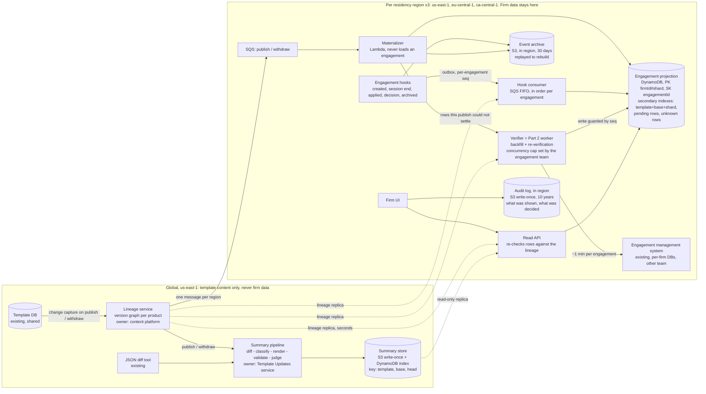

# Pending template updates: design

*Rates from `docs/design/cost-inputs.md` (AWS `us-east-1`, Anthropic pricing, 2026-09-19).*

## 1. Architecture and data ownership

A new Template Updates service adds one DynamoDB table per region, one row per engagement file. The row records which version the file sits on and whether an update is waiting. The engagement system stays the source of truth.

Two facts force that shape. First, finding out which version a file is really on means loading it. Each load costs a minute of another team's capacity, so the publish path may never load one (§3, row 2). Second, template content is identical for every firm, so one summary of the v5-to-v7 change serves every file on v5. Each product carries about 20,000 files (800,000 across 40 products) sitting on about a dozen versions. One publish therefore needs a dozen summaries, not 20,000.

The table is a projection: a copy of a few facts about each file, kept current by events rather than by loading the file. Those facts are the file's template, the version it is really on (its effective base), and the firm's decision history. A publish updates a small global lineage graph, a record of which version descends from which, and that triggers a cheap recompute of the affected rows in seconds. Only the verifier loads engagements, under a concurrency cap, and it is the Part 2 worker. The indicator commits to 60 seconds from a publish, not to seconds, and §5 says why.

The lineage graph is new and global, with one node per `(templateId, version)` holding its parents, market and status. Change data capture off the template database's write log feeds it, so no publish is lost to a failed emit. It answers one question: on the base's market branch, what is the newest published, non-withdrawn descendant? That version is the file's head. A publish that would leave two heads on a branch is refused unless it merges them.

The engagement projection is new, one table per region, keyed `PK = firmId#shard`, `SK = engagementId`, with `shard = hash(engagementId) mod 16`. A row holds the file's template, its `baseVersion`, its `pendingTarget` and `state` (`UNKNOWN`, `NONE` or `PENDING`), and a decision log. Sharding matters at the largest firm, whose 40,000 files might all sit on one product. Sixteen shards split that publish into 2,500 writes per key, or 42 a second across the 60-second budget, against DynamoDB's ceiling of 1,000 a second per key.

The engagement system belongs to the other team, and I ask it for six additive changes. Five are outbox hooks: each event is written in the same database transaction as the change it describes, so it cannot be lost. Each carries `seq`, a counter rising by one per engagement. They are `EngagementCreated`, `SessionEnded(effectiveVersion)`, `UpdateApplied(newVersion)` for an apply outside a session, `DecisionRecorded` and `EngagementArchived`, which retires the row. The sixth adds `{target, summaryId, diffHash}` to their decision record (§4).

On publish, the lineage sends one message per region. The materializer Lambda queries the projection's index on template and base once per live base, meaning a version at least one file still sits on, and turns the matches into about 20,000 conditional writes. No engagement is loaded. A row it cannot settle, because that base is `UNKNOWN`, goes to the verifier. The read API re-checks rows against the lineage as it serves them, so a withdrawn version disappears at once. For data residency, firm rows stay in region, while summaries are global because they hold no firm data (§4).

## 2. Correctness and production evolution

A row may be stale, but it may never say "no updates" when it does not know, so `UNKNOWN` reads to the user as "checking".

```mermaid
stateDiagram-v2
  [*] --> UNKNOWN : row seeded from the engagement list, base not yet confirmed
  UNKNOWN --> NONE : base confirmed, no eligible head
  UNKNOWN --> PENDING : base confirmed, an eligible newer head exists
  NONE --> PENDING : publish(T), T descends from the base on this branch, not declined
  NONE --> PENDING : publish(T), base withdrawn, T descends from its nearest published ancestor
  PENDING --> PENDING : publish(T2) newer than T, target and summary move to T2
  PENDING --> NONE : decline(T) logged; T and its ancestors back to the base are now covered
  PENDING --> NONE : withdraw(T), no other eligible target
  PENDING --> PENDING : withdraw(T), an older eligible target remains
  PENDING --> NONE : apply(T) confirmed by UpdateApplied or SessionEnded, base becomes T
  PENDING --> PENDING : apply(T) confirmed, a newer head already exists
```

Eligibility is descent on a market branch, not a version-number comparison, so a Canadian file is never offered a UK head. An accept is logged at once, but the row leaves `PENDING` only when the new base is confirmed. An accept of a version withdrawn since the page loaded is refused.

Say v4, v5 and v6 all publish before the user acts. The user sees one summary, base to v6, and makes one decision against that exact pair. A decline pins nothing about the file, which stays on its base. It covers every version between base and target, because the summary the user read contained those changes. The diff always starts from the file's actual base, so a declined v5 is never a diff origin. When v7 arrives carrying v5's changes the row returns to `PENDING(v7)`, annotated from the decision log rather than by a model: "includes changes from v5, declined on 3 March".

A withdrawal retargets rows inside the same 60-second budget. If the withdrawn version is a file's own base, two versions matter: the one the file holds, and its nearest published ancestor. Eligibility is worked out from that ancestor, so the file is not stranded. The diff still starts from the version the file holds. Worked case: a firm on v6 sees v6 withdrawn and the fix v7 branch off v5. It is offered v7, because v7 descends from v5, and reads the v6-to-v7 diff, because that is what the file holds.

Events can arrive late or out of order, but neither producer can lose one at the source: one is change data capture and the other an outbox. Hook events travel an SQS FIFO queue, one ordered group per file, each carrying `seq`. A write lands only if the row's counter is exactly one less, which also drops duplicates. Merely higher would not do, because a decline carrying counter 6 that arrives behind a session end carrying counter 7 would be rejected, and would vanish in silence. A message whose predecessor has not arrived is retried, and after ten minutes the row is flagged `unverified`.

Two writers touch a row, the materializer and the hook consumer. Both recompute `pendingTarget` and `state` from the same three inputs: the row's base, its decision log and the lineage. A hook writer whose lineage copy is older than the row's `lineageVersionApplied` waits and retries with a fresher one. A materializer write that fails its condition re-reads and recomputes, so neither writer drops a row.

Migration needs no window. Existing files are seeded as `UNKNOWN` rows from the engagement list (the cheap listing in assumption A2, §5), never overwriting a row, and confirmed by normal use or by the verifier. A confirmed row stays right, because a base changes only through an apply, and every apply is reported at session end or as `UpdateApplied`. A nightly job re-verifies any row whose last confirmation is older than the file's `lastOpenedAt` in that list. Deploy the lineage, the tables and the hooks behind flags, one region and one product at a time. Rollback is a flag that hides the indicator while the hooks keep writing, so re-enabling needs no second backfill.

Backfill piggybacks on normal use, because every session end confirms a row for free. The verifier sweeps the rest, round-robin, and no firm may hold more than 5% of its region's slots while another firm there waits. The largest firm alone is 667 slot-hours, so the cap stops it starving the other 3,999, and it takes every idle slot once they finish. The brief does not say what spare capacity the engagement team has. I assume 50 concurrent loads, to be negotiated before any date is promised: 33 in `us-east-1`, 17 across the other two, so 11 days (§3, row 3). At 25 it is 22 days.

A verifier result is not always safe to write, because the user may apply an update during the one-minute load. So the verifier re-reads the row before loading, to drop jobs that have moved on, and every write it then makes is conditional on the `seq` that read saw, so a write raced by a user event is discarded. A row that merely moved on while it queued still gets loaded and settled; only a move during the load throws the answer away. Both guards belong to the Part 2 contract.

## 3. Scale, cost and operational characteristics

The feature costs about $280 a month, or $1,090 at worst, against a ceiling I propose at $2,500. Inference is 88% of the expected $280, because the bill turns on one summary per version pair rather than one per file.

| # | Quantity | Arithmetic | Result |
|---|---|---|---|
| 1 | Publishes/month; files/product | 40/week × 52 ÷ 12; 800,000 ÷ 40 | 173; 20,000 |
| 2 | Naive publish path (rejected) | 20,000 files × 1 min | 333 downstream-hours; 3.3 h at 100-wide |
| 3 | Backfill capacity (one-off) | 800,000 files × 1 min = 13,333 slot-hours ÷ 50 concurrent slots = 267 h | 11 days |
| 4 | Backfill cost (one-off) | writes 1.6 M × 3 units × $0.625/M = $3. Summaries at 12 live bases: 40 × 12 = 480 one-off pairs × $0.117 (rows 7-8) = $56. At 52 bases: 2,080 pairs = $243 | $59–$246 |
| 5 | Fan-out writes | 173 publishes × 20,000 files = 3.46 M rows, each 1 unit on the table + 1 on the pending index. 6.9 M × $0.625/M | $4.3 |
| 6 | All other infrastructure | hooks 3 M events (3.75 opens/file/month, my figure; the brief gives none) × 3 units × $0.625/M = $5.6; SQS FIFO 3 M × 3 requests × $0.50/M = $4.5; Lambda, at most 7 M invocations (hooks + fan-out rows) × $0.20/M = $1.4, plus 7 M × 0.5 GB × 0.3 s = 1.05 M GB-s × $0.0000133 = $14; reads 10 M × $0.125/M = $1.3, storage 1 GB DynamoDB + 20 GB S3 = $0.7; +15% on the EU/Canada third, $1.4 | $29 |
| 7 | Generation, Sonnet 5 | 173 × 12 live bases = 2,080 summaries. Manifest (§4) of ~200 items × ~150 tokens = 30k in, 1,500-word summary = 2k out. 30k × $2/M + 2k × $10/M = $0.080 each | $166 |
| 8 | Judge, Haiku 4.5 | 32k in (manifest + summary), 1k out: 32k × $1/M + 1k × $5/M = $0.037 each, × 2,080 | $77 |
| 9 | **Expected total** | rows 5 + 6 + 7 + 8 | **≈ $276 / month** |
| 10 | Worst case: 52 live bases | 173 × 52 = 9,000 pairs × $0.117 = $1,053, plus $33 infrastructure | ≈ $1,090 / month |
| 11 | Per-file inference (rejected) | 3.46 M summaries × $0.080 | ≈ $277,000 / month |

Rows 7 and 8 exclude prompt caching and the Batch API, so they are upper bounds. The brief leaves «$X» blank. I propose $2,500 a month, nine times expected and twice the worst case. At a $500 ceiling the expected $276 fits and the worst case does not. The levers, in order: the Batch API at half price and a day's delay, then Haiku 4.5, then tighter filtering.

Observability rests on service level objectives that are measured and paged. For freshness, 99% of affected rows change within 60 seconds of the publish commit, per region, and a rendered summary exists for 95% of live pairs within 15 minutes. For projection health, `UNKNOWN` plus `unverified` stays under 1% after backfill, and drift, rows that disagree with the loaded file, under 0.1%, sampled by 200 random full loads a day. That sampling is the only alarm that sees silent drift. A sampled `NONE` row that should be `PENDING` pages on its own, because a firm may be skipping an evaluation it owed. For politeness, if engagement-open p99 rises 10% above baseline the verifier halves its cap, and inference spend is cut off at twice the expected figure.

Failure recovery is cheap by construction. A materializer crash costs nothing, because SQS redelivers and the write is conditional. Verifier work is keyed on the engagement, not the trigger, so a redelivery skips rows already settled and two triggers that meet on one row share a single load. An error that retrying cannot fix goes straight to the dead-letter queue, because five retries across 20,000 rows would burn 1,667 hours of the engagement team's capacity. Losing the projection means a restore and a replay of the 30-day event archive, not a 13,333-hour rebuild. Under any outage the row shows "checking" instead of "none".

## 4. Human-readable summaries: generation and evaluation

A summary passes through a JSON diff, a classifier, a renderer, validators and a judge, and ends as an immutable record.

The classifier maps diff paths to what an auditor cares about and emits the change manifest, a numbered list of typed items, each with a materiality tag and a raw path. Cosmetic churn collapses to a count. It is ordinary unit-tested code, and it is the quality lever and the token lever at once.

For example, the diff path `/sampling/materiality` changing from 5 to 3 becomes manifest item 3, `THRESHOLD_CHANGED(materiality, 5%, 3%)`, tagged material. Claude Sonnet 5 renders that as: *"The materiality threshold for sampling falls from 5% to 3%, so more transactions will fall into scope. [3]"* The bracket is the manifest item, and clicking it shows the raw diff path.

Sonnet 5 writes up the material items under a fixed, versioned prompt, and may write nothing outside the manifest. Validators check that every material item is cited, that every citation resolves, and that no unsupported number appears. Haiku 4.5 then judges each sentence for groundedness. It catches the misparaphrase validators cannot: a threshold called "raised" when it was lowered. One failure regenerates, a second falls back to the manifest.

Offline, about 100 historical version pairs carry reference summaries from the content team. Outputs are scored on material-item coverage, unsupported-claim rate (zero tolerated) and an expert rating. No prompt or model change ships without beating the incumbent, enforced as a build gate. In production, 20 summaries a week go to content-team review on the same rubric, and a week that scores below the offline bar blocks the next prompt change. A "was this accurate?" control is tied to the `summaryId`.

Each summary is written once and never edited. The record holds the text and its `summaryId`, the template and base-to-head pair, and a SHA-256 hash of the source diff. It also holds the classifier and prompt versions, the model ID, the timestamp, and the validator and judge results. It goes to S3 under Object Lock, storage that refuses edits and deletes, and is kept ten years. Ten is my assumption for the longest statutory audit retention in our markets, to be confirmed with legal. A cache miss writes a new record with a new ID instead of regenerating in place.

Two pieces of evidence sit outside the projection, because the projection can be rebuilt and a rebuild must not touch them. They are the shown-log, one row per view of `(engagementId, summaryId, userId, shownAt)`, and every `DecisionRecorded` event, both appended to an in-region Object Lock bucket. So in November you can produce the March text, the diff behind it, the model that wrote it and proof that this firm saw it before deciding.

## 5. Tradeoffs, assumptions, and the requirement I would challenge

Two of the three main tradeoffs are argued where they are made. Eventual consistency over authoritative reads (§1) parks rows at `UNKNOWN` during backfill. One summary per version pair rather than per file (§3) rules out firm-specific phrasing. The third has a recurring cost: re-offering beats suppressing on decline, so a firm that declines weekly is asked weekly, and no change it was obliged to evaluate is hidden.

I could not verify three assumptions. A1: the effective version is present in a rehydrated engagement, as it must be in order to apply an update, and can be emitted at session end. A2: the engagement system can cheaply list `(engagementId, firmId, productId, lastOpenedAt)`. A3: a file belongs to one market branch, inherited at creation.

The requirement I would challenge is "within seconds." I relax both halves openly. The *indicator* gets 60 seconds at p99, from the publish commit to the row changing. An auditor's decision horizon is days, so 5 seconds buys nothing over 60, and forcing it would push a synchronous cross-region fan-out onto the publish path. The *summary* gets 15 minutes, with the manifest visible at once. Seconds there would put a 20-to-60-second model call on the publish path for every pair, including pairs nobody reads. Withdrawal keeps the full 60, because lateness there harms someone.

The riskiest part to get wrong is the effective base version. The engagement record stores the version the file was *created* from, and applying updates is out of scope here. After the first apply, the projection is the only place that version can be read without a one-minute load. That load still returns it (assumption A1), and the verifier depends on it. If A1 is false there is no repair path for applied files, and I would ask the engagement team to record the version at apply time. Drift here is invisible to every dashboard. One direction hides an update a firm had to evaluate, the other puts a wrong summary in front of a professional.

I deliberately left out firm-level and bulk decisions. The record accepts a `batchId`, but the policy is product's call, and the cut costs the largest firm about 1,000 decisions per publish (40,000 files ÷ 40 products). Localisation is also out: about 16 languages, my figure and not the brief's, would take inference to roughly $3,900 a month. So is per-region inference, which buys no compliance, because no firm data reaches a model. Notifications, the UI, access control and the apply mechanism are out of scope.
