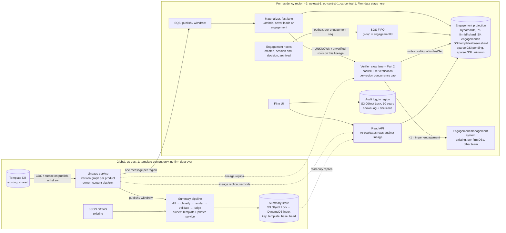
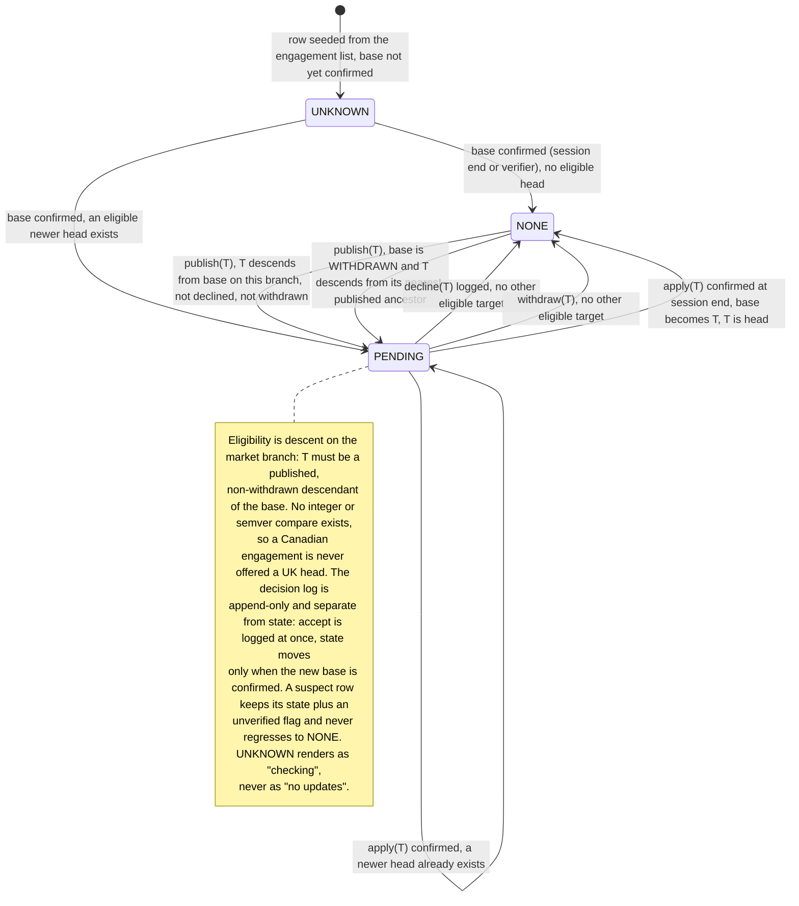

# Pending Template Updates: Design

*Rates from `docs/design/cost-inputs.md` (AWS `us-east-1`, Anthropic pricing, 2026-09-19). 2,616 words of prose plus 397 in tables, diagrams excluded.*

## 1. Architecture and data ownership

Two facts decide the shape. Reading an engagement's effective template version means loading it — a minute of another team's capacity — so the publish path must never load one (§3, row 2). And template content is not firm-specific, so one `base → head` summary serves every engagement on that pair; a publish spans only ~12 **live bases** (versions at least one engagement currently sits on, per product; A5), so each summary is reused ~1,700 times — $166 a month rather than $277,000.

So: a durable per-region **projection** of `(engagement, template, effective base, decision log)`, maintained by events. A publish updates a small global **lineage graph** and fans out a recompute over projection rows — seconds, cents, no engagement loaded. The one-minute load happens in one place only: the rate-limited **verifier** that backfills and afterwards re-checks distrusted rows, which is the Part 2 worker.

**Lineage graph** (new, global; content platform). One node per `(templateId, version)` with `parents[]`, `market`, `status`, `contentHash`, captured by CDC or outbox on the template DB's own writes, not by commit-then-emit code. It answers `head(templateId, base, market)`: the newest published, non-withdrawn descendant of `base` on that branch. It enforces one invariant — at most one published, non-withdrawn leaf per `(templateId, market)`, a second rejected unless it is a merge node — since two leaves strand whichever firms applied the other.

**Engagement projection** (new, one DynamoDB table per region; Template Updates owns it, the engagement system stays source of truth). Keyed `PK=firmId#shard, SK=engagementId`, `shard = hash(engagementId) mod 16`:

| Attribute | Meaning |
|---|---|
| `templateId`, `market` | Lineage this engagement is eligible for |
| `baseVersion`, `baseSource`, `lastVerifiedAt` | Effective base: creation version, replaced on a confirmed apply; source CREATE, SESSION_END, BACKFILL |
| `pendingTarget`, `state` | `head(templateId, baseVersion, market)` at last recompute; `UNKNOWN`, `NONE`, `PENDING` (§2) |
| `decisions[]` | Append-only `{target, diffHash, summaryId, decidedAt, decidedBy}` |
| `lastSeq`, `lineageVersionApplied`, `unverified` | Ordering guards; drift flag |

Three indexes: keys-only on `templateId#baseVersion#shard` for the fan-out; sparse on `firmId#shard` over `PENDING` rows for the file list and badge; sparse on `firmId#shard` over `UNKNOWN` rows as the backfill queue. The shard keeps the 40,000-engagement firm off one partition key: a publish spreads ~1,000 writes over 16 keys (~60 each, against DynamoDB's hard 1,000 WCU/s per key) and the badge is 16 parallel reads. The row is derived, but it is firm data: it stays in region, holds identifiers, versions and decisions only, and reaches no model. Region → global carries only anonymous counters (§4).

**Diff and summary store** (new, global). One immutable record per `(templateId, base, head)`: the deterministic JSON diff, the **change manifest** (a numbered list of typed, classified changes — the deterministic backbone the prose is rendered from and validated against, §4), the prose, and provenance. S3 Object Lock plus a DynamoDB index, replicated read-only per region, retained ten years (A8).

**Engagement system** (existing; the other team) remains source of truth. I ask for five additive changes on their outbox, each carrying a per-engagement monotonic `seq`: hooks `EngagementCreated`, `DecisionRecorded`, `SessionEnded(effectiveVersion)`, `EngagementArchived`, plus `{target, summaryId, diffHash}` on their decision record, pinning at source the artifact a decision was made against (§4).

**Publish flow.** Outbox event → lineage updated → one SQS message per region → the **materializer** queries the fan-out index per live base and expands it into SQS batches of ten rows, so 16 shards absorb the burst: ~20,000 conditional writes, no engagement loaded. The read API serves the pending list from the sparse index, re-evaluating each row against the in-memory lineage as it reads, so a withdrawal disappears at the next read. That can only demote: promotion happens through writes alone, so a lost fan-out write is bounded by the nightly recompute (≤24 h), not by the freshness SLO, which covers the fan-out path only. A second pass 60 s later over rows with `lineageVersionApplied < :lv` catches rows seeded meanwhile from a lagging replica.

## 2. Correctness and production evolution

**Accumulation: one decision, base → head.** If v4, v5 and v6 arrive before the user acts, they see one summary for `base → v6` and make one decision. The diff always starts from the engagement's actual base: declining v5 never moved it onto v5, so v5 is never a diff origin and the v7 summary is `base → v7`. If a newer head lands while a summary is open, the decision is recorded against the pair shown and the indicator re-raises for the new one.

**What "declined" pins.** Nothing about the engagement: it stays on its base, and the decline records `{target, diffHash, summaryId, who, when}`, suppressing that target only. When v7 arrives carrying v5's changes the row returns to `PENDING(v7)` with a deterministic line — "includes changes from v5, declined on 3 March by J. Smith" — from `ancestors(v7) ∩ decisions`, not the model. A firm that declines weekly is asked weekly: suppressing v7 hides content it never evaluated, and in audit the false "nothing pending" is the expensive error.

**Withdrawal.** The lineage marks the node withdrawn; readers exclude it within seconds and the materializer retargets affected rows inside the publish freshness budget. Withdrawing a node does not withdraw its descendants — the content team does that explicitly when the defect propagated — so a fix usually branches from the withdrawn node's parent, not from it. An engagement whose base is withdrawn is therefore evaluated against `head(templateId, nearestPublishedAncestor(base), market)`, any result offered as pending with the diff taken from its actual base (`v6 → v7`). Otherwise a firm on a withdrawn v6 hears "no pending updates" forever, because the fix v7 branches off v5.

**Unreliable and out-of-order delivery.** Both sources are outboxes, so nothing is lost at the producer. Engagement hooks ride SQS FIFO, `MessageGroupId = engagementId`, `MessageDeduplicationId = engagementId#seq`, applied conditional on `lastSeq = :seq - 1` — strict successor, not `<`, which as last-writer-wins would silently drop a decline of v5 arriving behind the session-end at seq+1 and leave the row pending on an update the user just declined. A gap returns the message with a delay and flags the row `unverified` past ten minutes. One rule governs the two writers: hook handlers write `baseVersion`, `baseSource`, `decisions[]` and `lastSeq` only, never `lineageVersionApplied`, and recompute `pendingTarget`/`state` as a pure function of (base, decisions, lineage at `max(replica, row.lineageVersionApplied)`), refusing to write when their replica is behind the row — otherwise a stale handler drags back a target the materializer already flipped forward.

**Loss and drift.** One invariant makes loss survivable: a base changes only while the engagement is loaded, and every session end emits the effective version — so a lost apply self-heals at the next open, and an unopened engagement cannot have drifted. Reconciliation compares `lastVerifiedAt` with the engagement list's `lastOpenedAt`, queueing a verification only for mismatches, `seq` gaps and missing engagements; a nightly recompute against the lineage (cents) catches a missed fan-out.

**Migration and backfill, no window.** Deploy lineage, empty tables and the hooks behind flags; seed one `UNKNOWN` row per active engagement from each firm's engagement list, after which the UI shows "checking". Backfill piggybacks first — every session end confirms a row free — then the verifier sweeps unopened files, most recently active first, round-robin with a 5% per-firm slot cap so the 40,000-file firm (667 slot-hours alone) cannot starve the other 3,999. A verifier result is not unconditionally safe to write: if the user applies during its one-minute load, writing back resurrects a stale base. So the enqueue carries `lastSeqAtEnqueue` and the write is conditional on `lastSeq = :lastSeqAtEnqueue`, discarded on failure because a newer hook already confirmed the row — part of the Part 2 contract, and the guard used after a hook outage too. Then shadow mode (200 daily spot-checks against full loads), pilot firms, GA per region, canary product first; rollback is a flag, schema changes additive.

## 3. Scale, cost and operational characteristics

| # | Quantity | Arithmetic | Result |
|---|---|---|---|
| 1 | Publishes/month; engagements/product | 40/week × 52 ÷ 12; 800,000 ÷ 40 | 173; 20,000 |
| 2 | Naive publish path (rejected) | 20,000 × 1 min | 333 downstream-hours; 3.3 h at 100-wide |
| 3 | Backfill (one-off) | 800,000 × 1 min; <$5 infra + $56-$243 inference | 13,333 slot-hours; 11 days at 50 slots |
| 4 | Fan-out writes | 173 × 20,000 = 3.46 M rows × 3 WRU (table + fan-out + pending index; `UNKNOWN` is sparse) = 10.4 M × $0.625/M | $6.5 |
| 5 | Hook writes | 3 M session events × 3 WRU = 9 M × $0.625/M | $5.6 |
| 6 | SQS | 9 M FIFO × $0.50/M (hooks); 1.0 M × $0.40/M (fan-out) | $4.9 |
| 7 | Lambda | 8.4 M × $0.20/M + 1.05 M GB-s × $0.0000133 | $15.7 |
| 8 | Reads and storage | 40 M RRU × $0.125/M; 2.4 GB × $0.25; 1.3 GB × $0.023 | $5.6 |
| 9 | EU / CA premium | +15% on the in-region third (~$13) | $1.9 |
| 10 | Summaries per month | 173 publishes × ~12 live bases on that product | 2,080 |
| 11 | Generation, Sonnet 5 | 2,080 × (30k in × $2/M + 2k out × $10/M) = 2,080 × $0.080 | $166 |
| 12 | Judge, Haiku 4.5 | 2,080 × (32k in × $1/M + 1k out × $5/M) = 2,080 × $0.037 | $77 |
| 13 | **Expected total** | rows 4-9, 11, 12 | **≈ $283 / month** |
| 14 | Worst case: 52 live bases | 9,000 pairs × $0.117 + $40 | ≈ $1,100 / month |
| 15 | Per-engagement inference (rejected) | 3.46 M × $0.080 | ≈ $277,000 / month |

*Rows 5-9 rest on assumptions, not brief constants: 800,000 engagements opened ~3.75×/month → ~3 M session events; the materializer expands each per-region publish message into SQS batches of ten → 346k messages, billed send + receive + delete; Lambda ≈ 3 M hooks + 0.35 M fan-out + 5 M read-API = 8.4 M at 0.25 s × 0.5 GB; ~5 M pending-list queries at 8 RRU (a 32 KB eventually-consistent page); projection row ~3 KB → 2.4 GB; summaries 2,080 × ~50 KB × 12 → 1.3 GB/year, plus a negligible in-region audit bucket (§4). A third of engagements assumed in EU+CA → ~$13 in region, at 15%, the top of the `cost-inputs.md` band.*

**Budget.** The brief leaves «$X» blank. I propose **$2,500 a month**: ~1% of what serving 4,000 firms already costs on existing platform spend, the ceiling below which a feature this size needs no business case. That is ~9× expected and ~2× worst case, and $0.60 per firm. Inference is 85% of the bill and turns on one choice: per engagement instead of per pair costs $277,000. At $500 the levers are the Batch API (−50%, a day not 15 minutes), then Haiku 4.5 for generation, then tighter manifest filtering; none changes the architecture. Backfill's real price is not dollars but another team's 13,333 hours.

**SLOs**, measured and paged.

- Freshness: template-DB commit → projection flip, p99 ≤ 60 s per region, canary publish every 15 minutes, page at 5. Covers the fan-out path only; a missed write is bounded by the nightly recompute.
- Summary availability: 95% of live pairs in 15 minutes, 100% in 2 hours; otherwise the manifest table.
- Projection health: `UNKNOWN` + `unverified` < 1% after backfill; sampled drift < 0.1% over 30 days from 200 random full loads a day — the only alarm that sees *silent* drift. A false negative (projection `NONE`, engagement eligible) pages: a firm may be skipping an evaluation it was obliged to make.
- Capacity: verifier in-flight against the per-region cap, DLQ depth per lane, daily inference with a hard stop at 2× expected — an outage is safer than a bill.

**Failure recovery.** Materializer crash: SQS redelivers and materialization is a pure function of (row, lineage), so a publish reruns from the lineage. Verifier misfire: keyed on `(engagementId, trigger)` per region, completed work skipped, non-retryable errors straight to the DLQ — 5 retries across 20,000 rows waste 1,667 downstream-hours. Lineage down: publishes queue, badges lag, reads unaffected. Inference stopped: the manifest is shown. Projection loss: PITR plus replay of the 30-day event archive, never a 13,333-hour rebuild; a regional outage returns "checking", never "none".

## 4. Human-readable summaries: generation and evaluation

The pipeline is: deterministic JSON diff (existing tool) → classifier → LLM renderer → deterministic validators → LLM judge → immutable record. The classifier maps diff paths to what an auditor cares about and emits the change manifest: typed items such as `PROCEDURE_ADDED`, `THRESHOLD_CHANGED(old, new)`, `DISCLOSURE_ITEM_REMOVED`, each with a materiality tag and raw path, cosmetic churn collapsed to a count. It is the quality lever and the token lever at once, and it is unit-testable. Claude Sonnet 5 renders the material items for a non-technical auditor under a fixed prompt version, citing manifest IDs and writing nothing outside the manifest. Validators check deterministically that every cited ID exists, every material item is cited and no number appears that the manifest lacks; Claude Haiku 4.5 judges each sentence for groundedness, catching the misparaphrase validators cannot — a threshold "raised" when it was lowered. One failure regenerates once; a second shows the manifest as a table and flags the pair for content review. The model never sees engagement content, and manifest and raw diff are always one click away.

**Evaluation.** Offline: ~100 historical pairs with content-team reference summaries, scored on material-item coverage, unsupported-claim rate (zero tolerated) and SME rating; nothing ships without beating the incumbent, as a CI gate. Online: validators and judge on 100% of outputs, the publishing team reviewing its own single-hop `parent → head` summary, multi-hop pairs sampled 5% weekly, and a "was this accurate?" control tied to the `summaryId`. A user review is firm data — the free text will name their client's situation — so it stays in that firm's region keyed by `summaryId`; only an anonymous per-region vote count reaches the global record.

**November.** The record is `{summaryId, templateId, base, head, SHA-256 of the diff, classifier version, prompt version, model ID, timestamp, text, validator results, judge verdict, reviews}`, written once to S3 under Object Lock for ten years; a cache miss never regenerates in place, it writes a new ID. Two further links must not depend on the derived projection row: the shown-log `(engagementId, summaryId, userId, shownAt)` and every `DecisionRecorded` event append to an in-region Object Lock bucket at the same retention, and `EngagementArchived` marks the row inactive rather than deleting it. So in November you can produce the text shown in March, the diff behind it, the model that wrote it, and evidence this firm saw it before deciding.

## 5. Tradeoffs, assumptions, and the requirement I would challenge

**Key tradeoffs.**

- **Eventual consistency over authoritative reads.** The projection is stale for the seconds between publish and flip, `UNKNOWN` rows for days during backfill. Bought: the indicator never waits a minute.
- **Per-pair over per-engagement summaries.** No firm-specific phrasing, ever. Bought: $166 instead of $277,000 a month.
- **Re-offer over suppress on decline.** A firm that declines weekly is asked weekly. Bought: no silently hidden change a firm was obliged to evaluate.

**Assumptions.** A1/A4/A7: "active" means the 800,000, archived files getting a row on reactivation; an engagement belongs to one market branch, inherited from its creation version; summaries are in the template's authoring language only. A2: the effective version is present in the rehydrated engagement — it must be, to apply an update — and can be emitted at session end; otherwise drift detection is sampling alone. A3: the engagement system can cheaply list `(engagementId, firmId, productId, lastOpenedAt)`. A5: ~12 live bases per product, sensitivity to 52 in §3. A6: a decline needs no rehydrate, or bulk decline for the largest firm becomes a capacity job. A8: ten years matches the longest statutory audit-file retention in the markets we serve; longer is a bucket-policy change.

**The requirement I would challenge: "within seconds."** I relax both halves rather than quietly miss them. The *indicator*: p99 ≤ 60 s from commit to projection flip — an auditor's decision horizon is days, the gap between 5 s and 60 s buys nothing, and forcing it would push synchronous cross-region fan-out onto the publish path. The *summary*: 15 minutes, manifest visible immediately. Seconds there would put a 20-60 s model call on the publish path for every pair, including ones nobody reads, forbid the Batch API and leave no room for the groundedness gate — for text a human reads minutes to days later. Withdrawal keeps the 60 s budget: that is where lateness actually harms someone.

**Riskiest to get wrong: the effective base version.** The stored field is the *creation* version and applying is out of scope, so after the first apply the projection is the only queryable place the effective base lives. Target, diff, summary and the decision all derive from it, and drift is invisible to any queue or latency dashboard: one direction hides an update a firm was obliged to evaluate, the other puts a wrong summary in front of a professional. Defences, in order: the session-end invariant, `lastOpenedAt` reconciliation, `UNKNOWN` ≠ `NONE`, 200 ground-truth loads a day.

**Deliberately left out.** Firm-level and bulk decisions — the record accepts a `batchId`, but policy is product's; the cut costs the largest firm ~1,000 decisions per publish. Hunk-level decline pinning, which needs stable change identity I have not verified the diff tool provides. Localisation: 16 languages multiply inference up to 16× (~$3,900 a month), over budget until product names the locales. Per-region inference, which buys no compliance since no firm data reaches the model. Notifications, the UI, IAM detail and the apply mechanism, out of scope per the brief.
