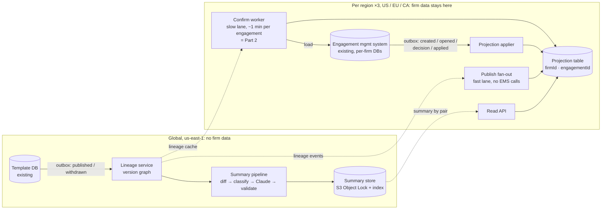
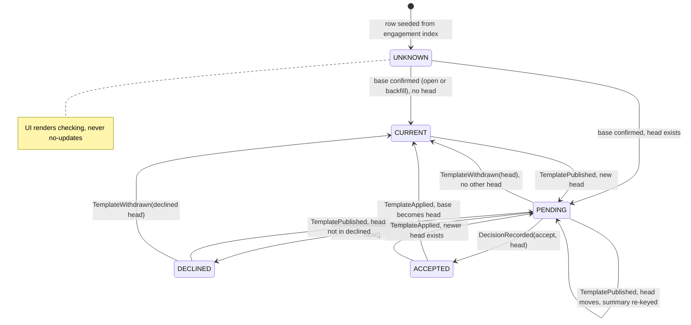

# Pending Template Updates: Design (Part 1)

**Decisions in one paragraph.** Introduce a durable, per-region **projection** of `(engagement, template, effective base version, decision state)`, built once and maintained by events forever after. Publishing a template never loads an engagement: it updates a tiny global **lineage graph** and fans out a recompute over projection rows, which takes seconds and costs cents. The one-minute engagement load is used in exactly one place, a rate-limited slow lane that does the backfill and afterwards only repairs rows the system distrusts. Human-readable summaries are generated once per `(template, base → head)` pair, never per engagement, from a deterministic diff, validated against that diff, and stored immutably for ten years. "Declined" pins a target version, not the engagement, so a later version carrying new content is offered again with the earlier decision visible.

## 1. Data model and ownership

Three stores, three owners.

**Template lineage graph (new, global, ours).** One node per `(templateId, version)` with `parents[]`, `market`, `status ∈ {PUBLISHED, WITHDRAWN}`, `publishedAt`, `contentHash`. Fed by a transactional outbox on the template database's publish and withdraw writes, not an application-side "commit, then emit", which loses the event whenever the second step fails. It answers one question: `head(templateId, baseVersion, market)`, the newest published, non-withdrawn version reachable from `baseVersion` along the market's lineage. It is small enough to cache in every worker, with a per-template `lineageVersion` counter. Template content is not firm-specific, so this store and the summary store below are global and replicate read-only into each region.

**Projection table (new, one per region, ours).** DynamoDB, keyed `PK=firmId, SK=engagementId`:

| Attribute | Meaning |
|---|---|
| `templateId`, `market` | The lineage this engagement is eligible for |
| `baseVersion`, `baseSource`, `baseConfirmedAt` | Effective base: the creation version, replaced on apply. Source is CREATE, OPEN, APPLY or BACKFILL |
| `head` | `head(templateId, baseVersion, market)` at last recompute, or null |
| `state` | `UNKNOWN`, `CURRENT`, `PENDING`, `DECLINED`, `ACCEPTED` (§2) |
| `declined` | map `targetVersion → {decidedAt, diffHash, userId}` |
| `lastSeq`, `lineageVersionApplied` | Idempotency guards for the two write paths |

GSI-1 on `templateId#baseVersion` serves the publish fan-out. GSI-2 is sparse on `firmId` for rows in `PENDING`, so "which of my engagements have pending updates" is one query even for the 40,000-engagement firm, and a per-firm counter row gives the badge count. The row stores identifiers, versions and decisions only. It deliberately does **not** store engagement content, financial fields, client names, the diff, or the summary text: the first three never leave the engagement store, and the last two are global by construction. I still treat this metadata as firm data and keep it in the firm's region (`us-east-1`, `eu-central-1`, `ca-central-1`), routed by the existing firm→region registry. Nothing flows region → global. What flows global → region is lineage and summaries, which contain no firm data.

**Engagement management system (existing, per-firm DBs, EMS team).** Remains the source of truth for the engagement, its effective template version and every accept/decline decision. The projection is a derived read model: when they disagree, EMS wins and the row is re-confirmed. We ask the EMS team for five additive hooks, emitted through their outbox with a per-engagement monotonic `seq`: `EngagementCreated`, `EngagementOpened` (carrying the template id and version already rehydrated in memory, a free read), `DecisionRecorded`, `TemplateApplied`, `EngagementArchived`.

**Summary store (new, global, ours).** One immutable record per `(templateId, baseVersion, headVersion)`: the deterministic JSON diff, the classified change manifest, the prose, and provenance (`promptVersion`, `modelId`, `generatedAt`, validator report, reviewer, `status`). S3 with Object Lock, indexed in DynamoDB, retained ten years, the longest audit-file retention we serve. A regeneration creates a new record and moves a pointer; nothing shown to a user is ever overwritten.

## 2. Correctness and production evolution

**Versions are a graph.** Eligibility is "a descendant of my base on my market's lineage", never `latest > current`. An engagement created from the Canadian branch is not offered a UK head. Withdrawal removes a node from `head()` without deleting it; every row whose `head` was the withdrawn version is recomputed within the same seconds budget as a publish, and its summary record is marked `WITHDRAWN` but kept.

**Accumulation and squash.** Everything published since the engagement's base collapses into one pending update, `base → head`, one summary and one decision. The diff is always computed from the engagement's actual base, never from a version it declined, because it is not on that version.

**What "declined" pins.** A decision is recorded against a specific target version and the `diffHash` the user saw. State is `DECLINED` while `head ∈ declined`; when a later head arrives, `head ∉ declined` and the row returns to `PENDING`. So a firm that declined v5 is offered v7 with the full base→v7 summary and a deterministic annotation, "includes changes from v5, declined on 3 March", computed from `ancestors(v7) ∩ declined`, not by the model. Nothing unevaluated is hidden; nothing decided is lost. A decision arriving after the head moved (the user had the summary open) is stored in `declined` for the record but does not change state; the UI shows the new head. Accepting moves the row to `ACCEPTED` until EMS emits `TemplateApplied`, which replaces `baseVersion` and recomputes.

**Unreliable delivery.** Both event sources are outboxes, so nothing is lost at the producer. SQS standard queues deliver at least once and out of order; the applier tolerates both with a conditional write: `lastSeq < :seq` for EMS events, `lineageVersionApplied < :lv` for fan-out writes. Replaying any event is a no-op. A gap in `seq` marks the row `stale`; a stale row keeps showing its last state and is queued to the slow lane for re-confirmation.

**Two lanes, one publish.** The fast lane handles a publish: bump the lineage, then for each base version on the affected lineage query GSI-1 and recompute `head` and `state` for every row, about 20,000 conditional writes, done in seconds, no EMS involvement. The slow lane is the only place the one-minute load happens: backfill, `UNKNOWN` and `stale` rows, and a daily correctness sample. Part 2 implements the slow lane; it is the half of the publish fan-out that can tolerate minutes because the badge has already been raised.

**Migration and backfill, no window.** (1) Deploy the lineage service and load the graph from the template DB: minutes. (2) Deploy projection tables and appliers; enable the EMS hooks behind a flag, in shadow mode. (3) Seed a row per active engagement from each firm's engagement index (id, product, status, last-modified) in state `UNKNOWN`. From this moment the UI can show "checking". (4) Start the slow lane against an EMS capacity grant. (5) Switch the UI to read the projection for internal firms, then region by region. (6) Enable the publish fan-out on a canary product. Rollback at any step is a flag, and accumulated projection state is kept. Rows carry `schemaVersion`; attributes are only ever added.

The backfill is 800,000 loads × 1 min = **13,333 slot-hours** of a system that also serves live opens and decisions. Assume the EMS team grants 50 concurrent slots on average (more off-peak): 3,000 per hour, 72,000 per day, **11 days** for everything. Two things shorten it. The `EngagementOpened` hook confirms every engagement a user touches at zero marginal cost, so active files, the ones a pending badge matters for, confirm themselves in the first days. And the slow lane orders work by last-modified descending, round-robin across firms with a 5% per-firm slot cap, so the 40,000-engagement firm (667 slot-hours on its own) cannot starve the other 3,999. The work queue is the sparse `UNKNOWN` index itself: a restart is a rescan, and confirming a row twice is harmless.

**Reconciliation.** Lineage-side drift (a missed fan-out) is caught by a nightly recompute of every row against the graph: pure DynamoDB, cheap. Engagement-side drift (a wrong `baseVersion`) can only be detected by loading, so the slow lane samples 0.5% of confirmed rows per day (4,000 loads, 67 slot-hours) and reports the disagreement rate as an SLI.

## 3. Scale, cost and operations

The brief leaves «$X» blank. I assume **$2,500/month**: about $0.60 per firm per month, and roughly ten times the projected spend, leaving room for localisation and a larger model. Rates are from `docs/design/cost-inputs.md`.

| Item | Arithmetic | $/month |
|---|---|---|
| Publish fan-out writes | 173 publishes × 20,000 rows × 3 (table + 2 GSIs) = 10.4M WRU × $0.625/M | 6.5 |
| EMS event writes | 3M events × 3 WRU = 9M × $0.625/M | 5.6 |
| UI reads | 5M queries × 8 RRU = 40M × $0.125/M | 5.0 |
| Projection storage | 800k × 1 KB × 3 = 2.4 GB × $0.25 | 0.6 |
| SQS | (3M events + 3.46M fan-out items) × 3 requests ≈ 20M × $0.40/M | 8.0 |
| Lambda | 7M req × $0.20/M + (7M × 0.25 s × 0.5 GB = 875k GB-s) × $0.0000133 | 13.1 |
| Summary storage | 2,080 records × 50 KB = 0.1 GB/month; 1.25 GB after a year × $0.023 | 0.03 |
| EU/CA regional premium | +15% on the in-region share, worst case ~$25 | 3.8 |
| **Inference, per pair, Sonnet 5** | 173 publishes × 12 live bases = 2,080 × (30k in × $2/M + 2k out × $10/M) = 2,080 × $0.08 | **166** |
| **Total** | | **≈ $209** |

Inference is 80% of the bill and it is decided by one choice. Priced per engagement instead of per pair, 3.46M summaries × $0.08, the same feature costs **$277,000/month**. Because template content is not firm-specific, one summary per pair is correct, not a compromise. Levers if «$X» turns out ten times smaller: the Batch API halves inference to $83 (summaries are read minutes to days after publish); Haiku 4.5 at $1/$5 halves it again to $42. Opus 5 at $5/$25 would cost $416, so the model tier is a quality decision for the evaluation set, not a budget one. The term scales linearly with live bases per product (12 assumed; 30 would give $415) and with locales. The one-off backfill costs under $5 on our side; its real price is 13,333 hours of another team's capacity, which is a negotiation, not a line item.

**SLOs.** Indicator freshness: p99 ≤ 60 s from template-DB commit to projection write, per region, measured by a canary publish on a test product every 15 minutes; page at 5 minutes. Summary availability: p95 ≤ 15 minutes after publish for automated validation, one business day for content-team sign-off. Correctness: sampled disagreement rate ≤ 0.1%; any sampled *false negative* (projection `CURRENT`, EMS says an update is eligible) pages, because it means a firm may skip an evaluation it was obliged to make. Coverage: `UNKNOWN` plus `stale` ≤ 1% of rows after backfill, alert on rising. Queue lag and DLQ depth per lane; slow-lane concurrency against the grant.

**Failure recovery.** Worker crash: at-least-once delivery plus conditional writes, resume. Lineage service down: publishes queue, badges lag (alert), reads unaffected. Projection table loss: DynamoDB point-in-time recovery, then replay the 30-day event archive from S3, never a 13,333-hour rebuild. Summary validation failure: show the deterministic manifest, never unvalidated prose, never nothing. Decision event lost: impossible at the producer (outbox); a duplicate is a no-op.

## 4. Human-readable summaries

**Generation.** The pipeline is deterministic until the last step. (1) The existing diff tool produces the JSON diff for `base → head`. (2) A rule-based classifier maps diff paths to a **change manifest**: typed items such as `PROCEDURE_ADDED`, `THRESHOLD_CHANGED(old, new)`, `DISCLOSURE_ITEM_REMOVED`, `WORDING_ONLY`, each with an id, a materiality tag and the raw path. (3) Claude Sonnet 5 renders material items into prose for a non-technical auditor, instructed to cite item ids inline and to write nothing not in the manifest; cosmetic churn is reported as a count. (4) A validator checks that every sentence cites a manifest id, every material item is mentioned, and every number in the prose appears in the manifest; failure falls back to a rendered manifest list. (5) The record is stored immutably with the provenance listed in §1. Summaries are generated eagerly at publish for every base on the lineage published in the last twelve months (the ~12 live bases) and lazily on a miss, with the badge raised meanwhile. The model never sees engagement content; only template diffs reach it.

**Evaluation.** Offline: a golden set of about fifty historical version pairs with content-team-written reference summaries, scored on material-item recall, unsupported-claim rate (zero tolerated) and readability, run as a CI gate on every prompt or model change, with Opus 5 as judge for the prose-quality dimension and humans for material recall. Online: the validator runs on 100% of outputs; the content team that published the update reviews the single-hop `parent → head` summary as part of their publish, because they know what they changed; multi-hop summaries are sampled at 10% for the same review.

**Defensibility in November.** The UI logs `(engagementId, summaryId, userId, shownAt)` in region. A regulator asking what the firm saw in March gets the exact prose, the exact diff it was derived from, the model and prompt that produced it, the validator's report and the reviewer's sign-off, retrieved by id and never regenerated. If the model is retired by November, nothing changes.

## 5. Tradeoffs, assumptions, the challenge

**The requirement I challenge: "within seconds."** The badge within seconds is cheap and I deliver it, because the fast lane never touches an engagement. But "seconds" applied to the summary is expensive in the wrong currency: it forbids the Batch API (half the inference bill) and, more importantly, it forbids the content-team sign-off that makes the summary defensible. Nobody reads a summary in the first seconds after publish; the decision is a days-scale workflow. I propose badge p99 ≤ 60 s, summary ≤ 15 minutes automated and one business day reviewed, with the deterministic manifest available immediately.

**Assumptions.** Each firm DB exposes a listable engagement index without rehydration (otherwise the whole firm shows "checking" until backfilled, at the same total cost). The EMS outbox provides a per-engagement `seq` (otherwise last-writer-wins by timestamp, repaired by the next open). Recording a decline does not require rehydrating the engagement (if it does, bulk decline for the 40,000-engagement firm is a multi-day capacity job, not a UI feature). Updates flow only along a market's lineage. One summary per pair, in the template's own language. "Active" bounds the backfill; archived engagements get a row on reactivation. Three residency regions cover today's firms; adding one is a redeploy of the regional stack.

**Riskiest to get wrong: the effective base version.** The stored field is the *creation* version and applying is out of scope, so after the first apply the projection is the only place the effective base lives. If it is wrong, every diff, every summary and every badge for that engagement is wrong, and the dangerous direction is silent: `CURRENT` when the truth is `PENDING`, an update a firm never evaluated. That is why `UNKNOWN` is a first-class state, why the open hook re-confirms on every use, why the daily sample measures disagreement as an SLO with a paging threshold for false negatives, and why the `TemplateApplied` hook is the one I would not ship without.

**Deliberately left out.** Firm-level or bulk decision policy for large firms: a product decision that changes the model, so the row reserves a `decisionBatchId` and nothing else. Hunk-level decline pinning (suppressing only the specific changes already declined): better UX, but it needs stable change identity from the diff tool that I have not verified exists. Localised summaries: multiplies the inference term by locales per market, and nothing in the brief settles it. Multi-region failover of the global lineage store: small enough that backups and a redeploy are adequate. Applying the update, the UI itself, and IAM detail.
