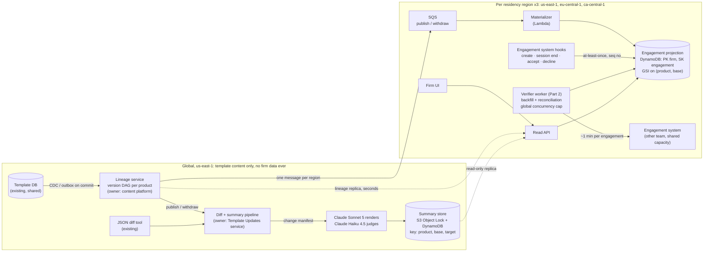
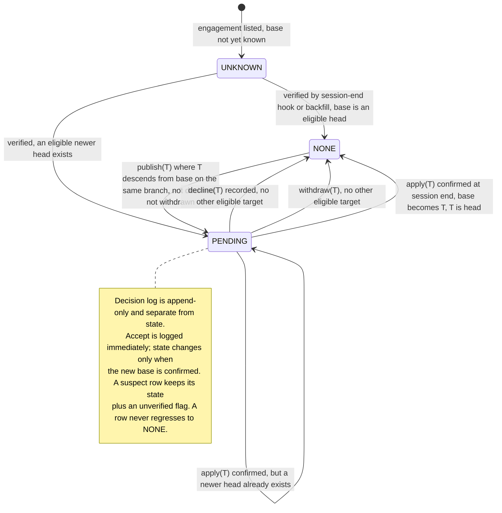

# Pending Template Updates: Design

*Part 1 of the take-home, draft B. Rates are from `cost-inputs.md` (AWS us-east-1 bulk price list and Anthropic published pricing, 2026-09-19). Diagrams are excluded from the page count.*

## 0. The numbers decide the architecture

Three calculations, done before any boxes were drawn.

**Per publish, never touch an engagement.** 800,000 engagements across 40 products is ~20,000 per product. Loading each one to read its template version costs 20,000 × 1 minute = 333 downstream-hours per publish, ~40 times a week, taken from the pods that serve engagement opens, creation and accept/decline for every user. At 100-way concurrency it is still 3.3 hours against a target of seconds. So the publish path reads a projection, never an engagement.

**Price inference per version pair, never per engagement.** Template content is not firm-specific, so a summary of "base → target" is identical for every engagement on that pair in every firm. A publish touches ~20,000 engagements but only as many pairs as the product has distinct live base versions; I assume ~12. One summary is reused ~1,700 times. That is the gap between ~$166 and ~$277,000 a month (§3), and every other decision here follows from it.

**Backfill is paid in another team's capacity, not dollars.** The only way to learn an existing engagement's version is to load it: 800,000 × 1 minute = 13,333 engagement-hours, or 11 days on 50 borrowed slots. The design must shrink that, spread it fairly across 4,000 firms, and be honest in the UI while it runs.

## 1. Architecture and data ownership

Three data classes, three owners; the region boundary follows the data. I treat an engagement ID plus its version and pending state as firm data and keep it in-region.

**Template lineage** (global; owned by the content platform). A small DAG per product: version → parents, market branch, status (published or withdrawn). Captured by CDC or a transactional outbox on the template database itself, not by application code, so a committed publish can never go unannounced. At 40 products × ~50 versions a year, every reader holds it in memory and refreshes within seconds.

**Diff and summary store** (global; owned by the new Template Updates service). Keyed by (product, base, target): the deterministic JSON diff, a classified change manifest, and the LLM summary with its provenance. No firm data, so it is produced once in us-east-1 and replicated read-only to eu-central-1 and ca-central-1.

**Engagement projection** (one DynamoDB table per residency region, partitioned by firm; owned by the Template Updates service, derived from the engagement system, which stays the source of truth). One row per active engagement: base version, `lastVerifiedAt`, pending target, an append-only decision log of {target, diffHash, summaryId, decidedAt, decidedBy}, and a state of UNKNOWN, NONE or PENDING. Fed by hooks on create, session end (with the effective version), accept and decline, and by the verifier. Nothing in it reaches a model.

**Publish flow.** CDC event → lineage updated → one SQS message per region → the materializer queries the (product, base) index and flips `pendingTarget` on affected rows, while the pipeline generates one summary per live (base → target) pair. The read API serves "which files have pending updates" from the projection and re-evaluates each row against the in-memory lineage as it reads, so a withdrawal disappears in seconds even before the materializer reaches the row. The 40,000-file firm is not a hot partition: a publish touches ~1,000 of its rows, one product's share.

**The one-minute load** is used in exactly two places: backfill, and re-verifying rows there is reason to distrust (§2). The Part 2 worker is that verifier. It owns a global concurrency cap negotiated with the engagement team, never gates the indicator, and treats the cap as a budget shared with live users.

## 2. Correctness and production evolution

**Versions are a graph.** An engagement is eligible for target T only if T is a published, non-withdrawn descendant of its base on the same market branch. The pending target is the newest eligible head. No integer comparison exists anywhere.

**Accumulation: one decision, base → head.** If v4, v5 and v6 arrive before the user acts, they see one summary for (base → v6) and make one decision. The diff is computed from the engagement's actual base, never from the previous version. If a newer version lands while the summary is open, the decision is recorded against the pair the user saw and the indicator re-raises for the newer head.

**What "declined" pins.** A decline pins the engagement's base and records a decision against one target and its diff hash. It suppresses that target only. When v7 arrives carrying v5's changes, the engagement becomes PENDING(v7); the summary is for (base → v7); the UI says "v5 was declined on [date] by [who]; v7 contains those changes plus [new ones]". A firm that declines weekly is asked weekly. I accept that cost: suppressing v7 because v5 was declined hides content the firm never evaluated, and in audit the false "nothing pending" is the expensive error.

**Withdrawal.** The lineage marks the version withdrawn; readers exclude it within seconds and the materializer retargets affected rows. Its summaries are kept for audit but marked superseded; an engagement that already applied it is flagged `baseWithdrawn` and becomes PENDING once a replacement ships. Decisions are never deleted.

**Unreliable delivery.** Hooks are at-least-once with a per-engagement sequence number; the projection applies them with conditional writes, so duplicates and reordering are no-ops. One invariant makes loss survivable: **an engagement's base can only change while it is loaded, and every session end emits the effective version** (A2). A lost apply event self-heals at the next open, and an unopened engagement cannot have drifted. Reconciliation compares two cheap fields, the projection's `lastVerifiedAt` and the engagement list's `lastOpenedAt` (A3), and queues a one-minute verification only for mismatches and for engagements missing from the projection. A suspect row keeps its state with an `unverified` flag; it never regresses to NONE.

**Migration with no maintenance window.**

1. Week 1: lineage capture plus a historical build from the template DB; empty projection tables; additive fire-and-forget hooks; all behind flags, UI off. Rollback is flag-off; the projection keeps accumulating.
2. Backfill by piggyback first: every open already loads the engagement, so active files fill themselves in for free. Then an explicit sweep for files not opened in N weeks, round-robin by firm so the 40,000-file firm (5% of the sweep) cannot starve the other 3,999, off-peak, under the cap.
3. Shadow (indicators computed, 200 spot-checks against ground truth, no UI), then pilot firms by flag, then general availability per region. While backfill runs, UNKNOWN rows show "checking for updates", never "none".

Schema changes are additive only; readers tolerate missing fields.

## 3. Scale, cost and operational characteristics

| # | Quantity | Arithmetic | Result |
|---|---|---|---|
| 1 | Publishes per month | 40 per week × 52 ÷ 12 | 173 |
| 2 | Engagements per product | 800,000 ÷ 40 | 20,000 |
| 3 | Naive publish path | 20,000 × 1 min | 333 downstream-hours; 3.3 h at 100-wide |
| 4 | Backfill | 800,000 × 1 min | 13,333 h; 5.6 days at 100 slots, 11 at 50 |
| 5 | Projection writes | 173 × 20,000 = 3.46 M × $0.625/M | $2.17 |
| 6 | SQS (upper bound: one message per row) | 10.4 M requests × $0.40/M | $4.16 |
| 7 | Reads, Lambda, storage | 8 M RRU × $0.125/M; 34,700 × 1 GB-s × $0.0000133; 0.8 GB × $0.25 + 5.2 GB × $0.023 | $1.79 |
| 8 | Summaries per month | 173 publishes × 12 live bases | 2,080 |
| 9 | Cost per summary | Sonnet 5: 30k in × $2/M + 2k out × $10/M | $0.080 |
| 10 | Generation | 2,080 × $0.080 | $166 |
| 11 | Judge (Haiku 4.5) | (32k in × $1/M + 1k out × $5/M) = $0.037 × 2,080 | $77 |
| 12 | **Expected total** | rows 5 to 7, 10, 11 | **≈ $251 / month** |
| 13 | Worst case: 52 live bases (no firm ever applies) | 9,000 × ($0.080 + $0.037) + $8 | ≈ $1,060 / month |
| 14 | Per-engagement inference (rejected) | 3.46 M × $0.080 | ≈ $277,000 / month |

Backfill inference is a one-off $56 to $243 (480 to 2,080 pairs, judge included). The 5 to 15% regional premium applies to ~$8 of regional infrastructure: cents.

**Budget.** The brief leaves «$X» blank; I propose $5,000 a month, under one cent per active engagement. Expected spend is ~$251 (20× headroom); worst case ~$1,060 (4.7×). If «$X» is really $500, the levers in order are the Batch API for non-head pairs (−50%), Haiku 4.5 for generation (−50%), then tighter manifest filtering. None changes the architecture; prompt caching is a further uncounted discount.

**SLOs**, each measured and paged:

- Indicator and withdrawal freshness: publish-to-flip p99 ≤ 60 s per region, measured by a canary product and one canary engagement per region; page at 5 minutes.
- Summary availability: 95% of live pairs within 15 minutes, 100% within 2 hours; otherwise the manifest table is shown.
- Projection health: UNKNOWN < 1% after backfill; sampled drift < 0.1%, from 200 random full loads a day (200 minutes of capacity). This is the only alarm that can see *silent* drift; queue depth cannot.
- Capacity and spend: verifier in-flight calls versus the cap, DLQ depth, and daily inference with a hard stop at 2× expected. An outage is safer than a bill.

**Failure recovery, by blast radius:**

- Materializer crash mid-publish: SQS redelivers, writes are idempotent, and materialization is a pure function of (row, lineage), so any publish can be rerun from the lineage table. Cost: seconds of staleness.
- Verifier misfires: a duplicate delivery is a duplicate one-minute call, so the verifier keys on (engagement, trigger) and skips completed work. A non-retryable error retried 5× across 20,000 rows would waste 1,667 downstream-hours, so those go straight to the DLQ; retryable ones back off with jitter under a per-publish retry budget, and the global cap bounds the worst case.
- Wrong lineage (mislabelled branch): every engagement on that product. Repair is fix and rerun; decisions made meanwhile stay recorded against what was shown.
- Inference outage or budget stop: the indicator is unaffected; the manifest is shown until generation resumes. A bad summary found later is never edited: it is marked superseded, a new summaryId is issued, and both are kept.
- Regional projection outage: reads return "checking", never "none"; decisions are still processed by the engagement system and replay into the projection.

## 4. Human-readable summaries: generation and evaluation

**Pipeline:** deterministic JSON diff (existing tool) → deterministic classifier → LLM renderer → deterministic validators → LLM judge → immutable record.

The classifier maps JSON paths to what an auditor cares about (procedures added or removed, materiality thresholds, required disclosures, guidance wording) and drops cosmetic churn, emitting a change manifest: a numbered list of material changes with before and after values. It is the quality lever and the token lever, and it is unit-testable.

Claude Sonnet 5 renders the manifest into prose under a fixed prompt version; every sentence must cite manifest IDs. Validators check, deterministically, that every cited ID exists, every material item is cited, and no number appears that is not in the manifest. Claude Haiku 4.5 judges any residual claim for groundedness. One failure triggers one regeneration; a second renders the manifest itself as a table and flags the pair for content-team review. The model never sees engagement content and never sits between the practitioner and the decision: the manifest and raw diff are one click away.

**Evaluation.** Offline: a golden set of ~100 historical pairs with reference summaries written by the content team; metrics are material-item coverage, unsupported-claim rate and SME rating; no prompt or model change ships without beating the current version on it. Online: validators and judge on 100% (priced in §3), SME review of a 5% weekly sample, and a "was this accurate?" control tied to the summaryId.

**November.** A summary is an audit artifact, not a cache entry. The record is {summaryId, product, base, target, SHA-256 of the diff, classifier version, prompt version, model ID, timestamp, text, validator results, judge verdict}, written once to versioned S3 with Object Lock and 10-year retention. The decision log stores the summaryId it was made against. A cache miss never regenerates in place; it creates a new record with a new ID. In November you can produce the exact text shown in March, the diff it came from, and the model that wrote it.

## 5. Tradeoffs, assumptions, the challenge, the risk, and what was left out

**Assumptions.**

- A1. "Active" means the 800,000; archived files are excluded from backfill and covered by the session-end hook if reopened.
- A2. The effective version is present in the rehydrated engagement (it must be, to apply an update) and is emitted at session end.
- A3. The engagement system can list (engagementId, firmId, productId, lastOpenedAt) cheaply; the file list UI already needs this.
- A4. An engagement belongs to one market branch, inherited from its creation version.
- A5. ~12 live base versions per product; sensitivity to 52 in §3.
- A6. Summaries in the template's authoring language only.
- A7. A firm-to-home-region mapping exists.

**The requirement I would challenge: "within seconds."** It is really two. The *indicator* within seconds is nearly free (lineage propagation plus a projection flip), so I keep it, and it is the right target for withdrawals. The *summary* within seconds puts a 20 to 60 second model call on the publish path for every pair, including pairs nobody will read, and leaves no time for the groundedness gate, for text a human reads minutes to days later. I commit to indicator p99 ≤ 60 s and summary within 15 minutes, with the manifest visible immediately. Same outcome for the user, and the gate stays.

**Riskiest to get wrong:** the projection's base version silently drifting from the engagement's real state. Pending target, diff, summary and the auditor's decision are all computed from that one field, and drift is invisible to any queue or latency dashboard. In one direction it hides an update a firm was obliged to evaluate; in the other it puts a wrong summary in front of a professional. The defences, in order: the session-end invariant, `lastOpenedAt` reconciliation, UNKNOWN ≠ NONE, and 200 ground-truth samples a day. If I could keep only one, it is the session-end hook.

**Deliberately left out.**

- Firm-level or bulk decisions for the 40,000-file firm. The data model allows it (a decision record can be stamped by a bulk action); the UX and policy are product's. Cost of the cut: ~1,000 individual prompts per publish for that firm.
- Localisation. 16 languages would multiply inference by up to 16× (~$2,700 a month): affordable, but pointless until product names the locales.
- Per-region inference. No firm data reaches the model, so it buys no compliance.
- Notifications, and the apply mechanism itself, which the brief places out of scope.
